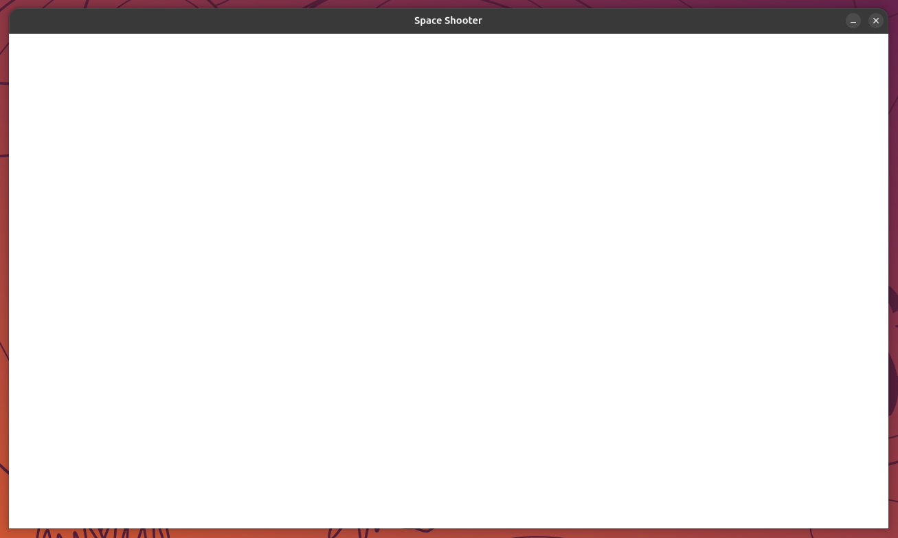

# Aufgabe 1 - Das erste pygame-Fenster

Bevor wir mit der Spieleentwicklung beginnen können, müssen wir uns zuerst um das minimale Setup kümmern.  
In diesem Modul lernst du die Grundstruktur eines pygame-Spiels kennen und erstellst dein erstes, leeres Spielfenster.



> [!IMPORTANT] Wichtig:
>
> Falls noch nicht geschehen: Führe zuerst einmalig das [Projekt-Setup](../../README.md#projekt-setup)
> aus dem Haupt-`README.md` durch (Repository klonen + `uv sync`). Ohne eine synchronisierte Umgebung
> schlägt schon `import pygame` unten fehl.

> [!NOTE] Info:
>
> Lege dafür im Ordner `game/` (im Projekt-Root) eine Datei `main.py` an. Dieser Ordner ist dein Arbeitsordner  
> für das gesamte Praktikum. Wir bauen ihn Modul für Modul weiter aus.

## Schritt 1 - pygame importieren

```python
import pygame
```

> [!NOTE] Info:
>
> Durch den Import erhalten wir Zugriff auf alle Funktionen und Klassen, die `pygame` bereitstellt.  
> Zum Beispiel zum Anzeigen von Bildern, Abfragen von Tastatureingaben oder Abspielen von Sounds und Musik.

## Schritt 2 - pygame initialisieren

```python
pygame.init()
```

> [!IMPORTANT] Wichtig:
>
> Mit dieser Anweisung werden alle internen Module von `pygame` initialisiert.  
> Ohne diesen Schritt funktionieren viele `pygame`-Funktionen nicht oder werfen sogar Fehler!

## Schritt 3 - Das Fenster erzeugen

Als nächstes definieren wir die Größe unseres Spielfensters und erzeugen eine sogenannte `Display Surface`.

```python
WINDOW_WIDTH, WINDOW_HEIGHT = 1280, 720
display_surface = pygame.display.set_mode((WINDOW_WIDTH, WINDOW_HEIGHT))
```

> [!NOTE] Info:
>
> Die `Display Surface` wird oft auch als Zeichenfläche oder Leinwand bezeichnet, da auf ihr der gesamte Spielinhalt gezeichnet wird!  
> Wir verwenden dafür eine gängige Auflösung (1280 × 720).

## Schritt 4 - Eine Clock erstellen

```python
clock = pygame.time.Clock()
FRAMERATE = 60
```

### Was ist eine Clock und wofür brauchen wir sie?
Die `Clock` sorgt dafür, dass unser Spiel mit einer konstanten Bildwiederholungsrate abgespielt wird.  
Ohne sie würde das Spiel in der maximal möglichen Geschwindigkeit der CPU laufen - was nicht nur zu schnell wäre, sondern auch unnötig viel Leistung verbrauchen würde.

> [!NOTE] Info:
>
> Wenn wir das Programm jetzt ausführen, sieht man, dass das Fenster kurz erscheint und sich direkt wieder schließt.  
> Das liegt daran, dass das Programm direkt nach dem Start sofort wieder beendet wird.  
> Es fehlt noch ein entscheidendes Element: die **Game Loop**!


## Schritt 5 - Die Game Loop

### Was ist die Game Loop?

Die Game Loop, das Herzstück eines Spiels, ist eine Endlosschleife, die so lange läuft, wie das Spiel aktiv ist.  
In jedem **Durchlauf** ("Frame") werden folgende Dinge erledigt:

1. Events abfragen - z. B. ob der Spieler auf das "X", Beenden geklickt hat
2. Zeichenfläche zurücksetzen - damit der Inhalt des vorherigen Bilds "übermalt" wird
3. **Spiellogik** aktualisieren - z. B. Positionen von Objekten berechnen
4. **Rendering**: Objekte auf der Zeichenfläche zeichnen - z. B. Bilder anzeigen
5. Anzeige aktualisieren - das gezeichnete Bild sichtbar machen
6. Bildwiederholungsrate begrenzen - damit alles flüssig, aber nicht zu schnell läuft

```python
running = True
while running:
    # 1. Eingaben (Events) abfragen
    for event in pygame.event.get():
        if event.type == pygame.QUIT:
            running = False

    # 2. Zeichenfläche zurücksetzen
    display_surface.fill("white")

    # 3. TODO: Spiellogik aktualisieren

    # 4. TODO: Objekte auf der Zeichenfläche zeichnen (Rendering)

    # 5. Änderungen auf der "display_surface" sichtbar machen
    pygame.display.flip()

    # 6. Bildwiederholungsrate (FPS) limitieren
    clock.tick(FRAMERATE)
```

> [!NOTE] Info:
>
> Die Anwendung läuft jetzt dauerhaft, bis das `pygame.QUIT`-Event eintritt,  
> also z. B. wenn der Spieler das Fenster über das "X" beendet.

> [!TIP] Tipp:
>
> **▶ Führe das Programm jetzt aus:** Das Fenster sollte offen bleiben und sich erst schließen, wenn du auf das "X" klickst.  
> Falls nicht, vergleiche deinen Code Zeile für Zeile mit den Schritten 1-6 oben, bevor du weitermachst.

## Schritt 6 - Die Anwendung richtig beenden

Wenn man die Event-Loop genauer betrachtet, sehen wir, dass das `pygame.QUIT` Event wichtig ist, damit wir unser Spiel auch beenden können.  
Falls dieser Fall eintritt, wird `running` auf `False` gesetzt und die Game Loop kein weiteres Mal durchlaufen.  
Da im Hintergrund noch `pygame`-Prozesse laufen, ist es wichtig, `pygame` sauber zu beenden.

```python
pygame.quit()
```

> [!IMPORTANT] Wichtig:
>
> Ohne diesen Schritt kann es zu Speicherlecks oder nicht korrekt freigegebenen Ressourcen kommen!

## Zusatzaufgabe: Fenstertitel anpassen

Wenn wir das Programm jetzt ausführen, steht oben im Fenster noch `pygame window`.  
Das lässt sich zum Glück leicht ändern. Wie man das macht, findest du [hier](https://pyga.me/docs/ref/display.html).
