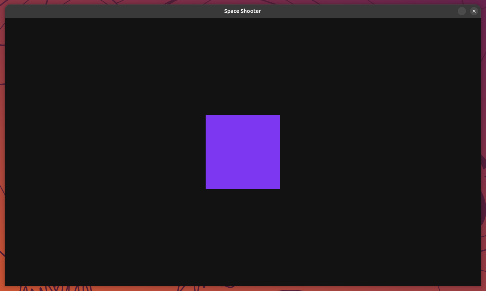

# Aufgabe 2 - Inhalt auf der Leinwand anzeigen

Jetzt, wo unser Spielfenster steht, wollen wir etwas zeichnen!  
In diesem Modul lernst du, wie man ein farbiges Rechteck auf der Zeichenfläche anzeigt und wie man es gezielt positionieren kann.



## Schritt 1 - Eine neue Surface erzeugen

Als erstes erstellen wir eine neue Surface mit einer Größe von 200 × 200 Pixel.  
Füge den folgenden Code nach der Zeile `FRAMERATE = 60` ein:

```python
square = pygame.Surface((200, 200))
```

> [!NOTE] Info:
>
> Wenn wir das Programm nun ausführen, sehen wir, dass die neue Surface `square` noch nicht sichtbar ist.  
> Der Grund ist, dass `square` aktuell nur im Speicher existiert und noch nicht auf  
> die `display_surface` gezeichnet wurde!

## Schritt 2 - Neue Surface sichtbar machen

Jetzt wollen wir das **Quadrat** auf unserer **Display Surface** sichtbar machen.  
Das gehört zum **Rendering**-Schritt (4.) der Game Loop, nicht zur Spiellogik (3.) - füge dazu vor  
`pygame.display.flip()` folgende Zeile ein:

```python
while running:
    # {...}

    # 3. TODO: Spiellogik aktualisieren

    # 4. Objekte auf der Zeichenfläche zeichnen (Rendering)
    display_surface.blit(square, (0, 0))  # <---

    # 5. Änderungen auf der Zeichenfläche sichtbar machen
    pygame.display.flip()
    # {...}
```

> [!NOTE] Info:
>
> Die Methode `.blit()` fügt eine Surface auf eine andere ein, in unserem Fall `square` auf `display_surface`.  
> (0, 0) ist die Position auf der `display_surface`, an der das Quadrat erscheinen soll.

> [!TIP] Tipp:
>
> **▶ Führe das Programm jetzt aus:** Du solltest ein kleines, weißes Quadrat oben links im Fenster sehen.

## Schritt 3 - Wie funktionieren Positionen in pygame?

In pygame ist der **Ursprungspunkt (0, 0)** immer in der **oberen linken Ecke**.  
Dieses Verhalten gilt für alle Surfaces, nicht nur für die Display Surface!

```python
(0,0) ─────────────────────> x (rechts)
  │
  │          Surface
  ▼
  y (unten)
```

### Das bedeutet:
* **X-Wert:** 0 ist ganz links, positive Werte bewegen das Objekt nach rechts
* **Y-Wert:** 0 ist ganz oben, positive Werte bewegen das Objekt nach unten.

## Schritt 4 - Quadrat oben rechts positionieren

Da wir nun die Positionierung in pygame kennen, können wir das Quadrat z.B. **oben rechts in der Ecke** positionieren.

> [!NOTE] Info:
>
> Gegeben sind die Breite der Display Surface, die Breite des Quadrats, sowie die Ursprungspunkte der Surfaces!

**Aufgabe:** Berechne die passende Position für `display_surface.blit(square, (...))`, sodass das Quadrat oben  
rechts in der Ecke erscheint. Probiere es zuerst selbst, bevor du unten nachschaust.

<details>
<summary>

#### Lösung

</summary>

Um den X-Wert zu berechnen, nehmen wir die `WINDOW_WIDTH` (1280 Pixel), also die Breite unserer Display Surface  
und ziehen die Breite des Quadrats (200 Pixel) ab, da der Ursprung des Quadrats bei (0, 0) verschoben wird.

```python
display_surface.blit(square, (WINDOW_WIDTH - 200, 0))
```

> [!NOTE] Info
>
> Man könnte jetzt meinen, dass man jedes Mal die Position anhand von Pixeln selbst berechnen muss, aber dafür  
> gibt es in pygame einen deutlich besseren Ansatz.

</details>

## Schritt 5 - Positionen setzen, aber einfach!

Jede Surface in pygame kann über `.get_rect()` ein sogenanntes **Rect-Objekt** erhalten.  
Das **Rect** ist ein Rechteck mit vielen hilfreichen Attributen.  
Es stellt z.B. Attribute wie
* `topleft`
* `topright`
* `center`
* `bottomleft`
* usw. zur Verfügung.

Füge den folgenden Code nach der Zeile `square = pygame.Surface((200, 200))` ein:

```python
square_rect = square.get_rect()
square_rect.topright = (WINDOW_WIDTH, 0)
```

Und ändere die Anzeige innerhalb der Game Loop entsprechend ab:

```diff
  # 4. Objekte auf der Zeichenfläche zeichnen (Rendering)
- display_surface.blit(square, (WINDOW_WIDTH - 200, 0))
+ display_surface.blit(square, square_rect)
```

## Schritt 6 - Quadrat mittig positionieren

Da wir nun Rects kennengelernt haben, möchten wir unser Quadrat  
**genau mittig** auf der Display Surface platzieren.

**Aufgabe:** Ändere `square_rect` so ab, dass das Quadrat mittig auf der Display Surface liegt, statt oben  
rechts. Probiere es zuerst selbst, bevor du unten nachschaust.

<details>
<summary>

#### Lösung

</summary>

Um die X- sowie Y-Position berechnen zu können, benötigen wir hierfür die Breite und Höhe  
unserer Display Surface und teilen diese jeweils durch 2, um das Zentrum zu erhalten.  
Mit Hilfe des `center` Attributs zentrieren wir das Rect auf der Display Surface.

```diff
  square_rect = square.get_rect()
- square_rect.topright = (WINDOW_WIDTH, 0)
+ square_rect.center = (WINDOW_WIDTH / 2, WINDOW_HEIGHT / 2)
```

</details>

> [!TIP] Tipp:
>
> **▶ Führe das Programm jetzt aus:** Das Quadrat sollte jetzt genau in der Mitte des Fensters liegen.

## Schritt 7 - Farbe des Quadrats ändern

So wie wir die Display Surface bei jedem Schleifendurchgang der Game Loop weiß färben,  
können wir das gleiche mit dem Quadrat machen.  
Färbe das Quadrat z.B. in der Farbe Lila ein.

> [!NOTE] Info:
>
> pygame liefert bereits einige Farben mit Namen aus. Eine vollständige Liste findest du [hier](https://pyga.me/docs/ref/color_list.html).  
> **Alternativ** lassen sich Farben auf zwei weitere Arten angeben:
>
> * Als **RGB-Tupel** aus drei Werten (**R**ot, **G**rün, **B**lau) zwischen `0` und `255`,  
>   z.B. das Lila, das wir gleich für unser Quadrat verwenden: `(125, 55, 240)`
> * Als **Hex-Code** (ein `#` gefolgt von 6 Hexadezimalziffern - jeweils zwei für Rot, Grün und Blau),  
>   z.B. dasselbe Lila als `"#7d37f0"` - Hex-Codes sind das Format, das dir z.B. in Design-Tools oder  
>   einem [Color Picker](https://g.co/kgs/tF3J2hR) meistens direkt angezeigt wird
>
> Beide Schreibweisen ergeben exakt dieselbe Farbe. Welche du verwendest, ist Geschmackssache.

<details>
<summary>

#### Lösung

</summary>

Füge folgende Zeile z.B. nach `square = pygame.Surface((200, 200))` ein:

```python
square.fill("#7d37f0")
```

</details>

## Schritt 8 - Hintergrund einfärben

Jetzt, wo unser Quadrat Farbe hat, wirkt der weiße Hintergrund nicht mehr passend zu einem Weltraum-Spiel.  
Wir ersetzen ihn durch ein dunkles "Space Black", ebenfalls als Hex-Code:

```diff
  # 2. Zeichenfläche zurücksetzen
- display_surface.fill("white")
+ display_surface.fill("#121212")
```

> [!TIP] Tipp:
>
> **▶ Führe das Programm jetzt aus:** Du solltest jetzt ein lila Quadrat mittig auf einem dunklen Hintergrund sehen -  
> das ist die Farbgebung, die wir für den Rest des Praktikums beibehalten.
