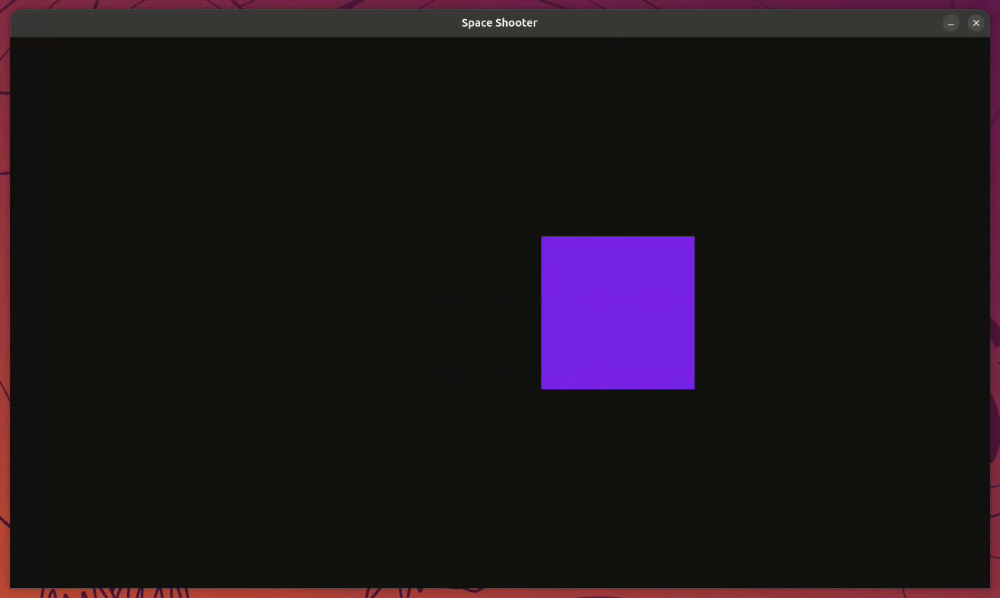

# Aufgabe 4 - Projektile feuern

In diesem Modul erweitern wir unser Spiel um Projektile, die vom Spieler abgefeuert werden können.  
Dabei orientieren wir uns an unserem Quadrat und lernen,  
wie man mit einem Tastendruck Objekte erstellt und sie über Zeit bewegt.



## Schritt 1 - Projektil als Surface definieren

Wie bei unserem Quadrat, brauchen wir auch für Projektile zwei Dinge:

1. Eine **Surface**, welche das Aussehen definiert
2. Ein **FRect**, welches die Position auf dem Bildschirm beschreibt

**Aufgabe:** Erstelle ein Projektil mit den Maßen `10 x 40` und positioniere es testweise auf dem Bildschirm.  
Probiere es zuerst selbst, bevor du unten nachschaust.

<details>
<summary>

#### Lösung

</summary>

Füge unterhalb der Quadrat-Definition folgendes ein: 

```python
# Projektil definieren
projectile = pygame.Surface((10, 40))
projectile.fill("#4deeea")
projectile_rect = projectile.get_frect()
```

> [!NOTE] Info:
>
> Neu erstellte Surfaces sind standardmäßig **schwarz**. Auf unserem dunklen Hintergrund (`"#121212"`) wäre  
> das Projektil damit praktisch unsichtbar. Deshalb färben wir es direkt nach dem Erstellen mit `.fill()`  
> in einem hellen Türkis ein.

Damit wir die neue Surface auch sehen können, müssen wir sie in Schritt 4 (Rendering) der Game Loop zeichnen:

```python
display_surface.blit(projectile, projectile_rect)
```

</details>

## Schritt 2 - Mehrere Projektile durch eine Liste verwalten

### Warum reicht ein `projectile_rect` nicht aus?

Wenn wir bei jedem Tastendruck ein neues Projektil erzeugen wollen, brauchen wir **für jedes** eine **eigene Position**.  
Ein einzelnes `FRect` (wie `projectile_rect`) speichert aber nur eine Position, dadurch würde jedes neue Projektil einfach das alte überschreiben.

**Lösung:** Wir erstellen eine **Liste**, in der wir alle `FRects` der aktiven Projektile speichern.
So können wir **jedes einzelne** Projektil verwalten und zeichnen.

Ersetze deshalb:

```diff
- projectile_rect = projectile.get_frect()
+ projectile_rects = []
```

> [!NOTE] Info:
>
> Eine Liste ist ideal, um mehrere Objekte gleichzeitig zu verwalten.  
> Genau wie ein Spiel mehrere Gegner oder Partikel enthalten kann,  
> können wir hier mehrere Projektile gleichzeitig sichtbar machen.  
>  
> `projectile_rects` wird später bei jedem Schuss mit einem neuen `FRect` gefüllt,  
> also immer mit der Position, an der das neue Projektil erscheinen soll.

Kommentiere vorübergehend die Zeile aus, in der du das Projektil gezeichnet hast:

```diff
- display_surface.blit(projectile, projectile_rect)
+ # display_surface.blit(projectile, projectile_rect)
```

## Schritt 3 - Projektil per Leertaste erstellen

Nun fragen wir in Schritt 3 (Spiellogik) der Game Loop ab, ob die Leertaste gedrückt wurde.  
**Aufgabe:** Versuche das zuerst selbst. Hierbei kann man sich an unsere vorherigen Abfragen orientieren.  
Wenn `space` gedrückt wird, gebe z.B. einen Text `Abschuss!` aus.

<details>
<summary>

#### Lösung

</summary>

Bei der Gelegenheit spendieren wir beiden Tastenabfragen einen kurzen Kommentar:

```diff
+ # Tasten-Abfrage, um Quadrat zu bewegen
  if keys[pygame.K_w]:
      square_rect.y -= 600 * delta_time
  # {...}
  if keys[pygame.K_d]:
      square_rect.x += 600 * delta_time

+ # Tasten-Abfrage, um Projektil zu erstellen
+ if keys[pygame.K_SPACE]:
+     print("Abschuss!")
```

</details>

Nun soll beim Drücken der Leertaste ein Projektil erstellt und zur Liste `projectile_rects` hinzugefügt werden.  
Achte darauf, dass es **oberhalb** des Quadrats erscheinen soll.

> [!NOTE] Info:
>
> Um das Projektil direkt oberhalb des Quadrats zu platzieren, nutzen wir die Position `midtop` vom Quadrat.  
> Weitere Positionen: [Offizielle Doku](https://pyga.me/docs/ref/rect.html#:~:text=The%20Rect%20object%20has%20several%20virtual%20attributes%20which%20can%20be%20used%20to%20move%20and%20align%20the%20Rect%3A)

<details>
<summary>

#### Lösung

</summary>

Entweder:

```diff
  if keys[pygame.K_SPACE]:
-     print("Abschuss!")
+     temp = projectile.get_frect()
+     temp.midbottom = square_rect.midtop
+     projectile_rects.append(temp)
```

Oder kurz:

```diff
  if keys[pygame.K_SPACE]:
-     print("Abschuss!")
+     temp = projectile.get_frect(midbottom=(square_rect.midtop))
+     projectile_rects.append(temp)
```

</details>

## Schritt 4 - Alle Projektile anzeigen

Aktuell sehen wir unsere Projektile noch nicht, da wir nur **eins** gezeichnet hatten und es auch auskommentiert ist.  
**Aufgabe:** Jetzt versuchen wir alle Projektile aus unserer Liste `projectile_rects` in Schritt 4 (Rendering) zu zeichnen.

> [!NOTE] Info:
>
> Eine **for-Schleife** hilft uns, jedes `FRect` aus der `projectile_rects` zu zeichnen.  
> So können mehrere Projektile unabhängig voneinander angezeigt und später bewegt werden.  
> **Beispiel:** `for rect in rects:`

<details>
<summary>

#### Lösung

</summary>

```diff
- # display_surface.blit(projectile, projectile_rect)
+ for projectile_rect in projectile_rects:
+     display_surface.blit(projectile, projectile_rect)
```

</details>

> [!TIP] Tipp:
>
> **▶ Führe das Programm jetzt aus:** Mit `SPACE` sollten jetzt (unbewegliche) Projektile über dem Quadrat erscheinen.

## Schritt 5 - Projektile nach oben bewegen

Jetzt bringen wir unsere Projektile in Bewegung.  
Da der Ursprung  `(0, 0)` oben links ist, bewegen sich Objekte nach oben, wenn wir ihre `y`-Koordinate verringern.  
Wichtig: Das **Bewegen** von Objekten ist Spiellogik und gehört deshalb in Schritt 3 (Spiellogik) der Game Loop.  
Das **Zeichnen** bleibt in Schritt 4 (Rendering). Erst bewegen, dann zeichnen!  
**Aufgabe:** Ergänze in Schritt 3 (Spiellogik) eine eigene Schleife, die jedes Projektil aus `projectile_rects` nach oben bewegt.

> [!NOTE] Info:
>
> Genau wie beim Quadrat nutzen wir `delta_time`, um die Bewegungsgeschwindigkeit unabhängig von der Framerate zu machen.

<details>
<summary>

#### Lösung

</summary>

Füge in Schritt 3 (Spiellogik) unterhalb der Leertasten-Abfrage folgendes ein:

```diff
  if keys[pygame.K_SPACE]:
      # {...}

+ # Projektile bewegen
+ for projectile_rect in projectile_rects:
+     projectile_rect.y -= 800 * delta_time
```

Die Zeichen-Schleife aus Schritt 4 (Rendering) bleibt dabei unverändert.

</details>

> [!TIP] Tipp:
>
> **▶ Führe das Programm jetzt aus:** Die Projektile sollten jetzt nach dem Abschuss nach oben fliegen und den Bildschirm verlassen.

## Schritt 6 - Cooldown für die Feuerrate

Wenn man die Leertaste aktuell gedrückt hält, werden extrem viele  
Projektile pro Sekunde erzeugt.  
Das sieht nicht nur nicht gut aus, sondern bremst auf Dauer auch das Spiel aus.  
**Lösung:** Wir brauchen eine Art Cooldown, also eine Mindestzeit, die zwischen zwei Schüssen vergangen sein muss.

Füge folgende Zeile unterhalb der Projektil-Liste ein:

```python
last_shot = pygame.time.get_ticks()  # in ms
```

Dann bei unserer Tastenabfrage innerhalb der Game Loop:

```python
# Tasten-Abfrage, um Projektil zu erstellen
if keys[pygame.K_SPACE]:
    current_time = pygame.time.get_ticks()  # in ms

    if current_time - last_shot >= 500:
        temp = projectile.get_frect(midbottom=(square_rect.midtop))
        projectile_rects.append(temp)
        last_shot = current_time
```

> [!NOTE] Info:
>
> `pygame.time.get_ticks()` liefert uns die Zeit, die seit `pygame.init()` in Millisekunden vergangen ist.  
> Mit `>= 500` sagen wir, dass mindestens `0.5` Sekunden bis zum nächsten Schuss gewartet werden muss, bis ein neues Projektil erstellt werden darf.  
> `current_time - last_shot` berechnet dabei die Zeit seit dem letzten Schuss. Deshalb müssen wir `last_shot` nach jedem Schuss auf `current_time` aktualisieren, sonst würde der Cooldown nach dem ersten Schuss nie wieder greifen.

> [!TIP] Tipp:
>
> **▶ Führe das Programm jetzt aus:** Auch beim Gedrückthalten von `SPACE` sollte jetzt höchstens alle 0,5 Sekunden ein neues Projektil erscheinen.

## Schritt 7 - Projektile außerhalb des Bildschirms entfernen

> [!WARNING] Achtung:
>
> Ein Problem bleibt noch: Unsere Projektile verlassen zwar den Bildschirm, bleiben aber für immer in der Liste  
> `projectile_rects`. Die Liste wächst also mit jedem Schuss weiter und das Spiel muss in jedem Frame unsichtbare  
> Projektile mitbewegen und zeichnen. Das kostet auf Dauer unnötig Leistung.

**Lösung:** Wir behalten nur die Projektile, die noch sichtbar sind. Ein Projektil ist komplett aus dem Bild  
verschwunden, sobald seine **Unterkante** (`rect.bottom`) über den oberen Bildschirmrand (`y = 0`) hinaus ist.

Füge dazu in Schritt 3 (Spiellogik) direkt nach der Bewegungs-Schleife folgendes ein:

```python
    # Projektile außerhalb des Bildschirms entfernen
    projectile_rects = [rect for rect in projectile_rects if rect.bottom > 0]
```

> [!NOTE] Info:
>
> Diese kompakte Schreibweise nennt man **List Comprehension**: Sie baut eine **neue Liste** auf, in die nur die  
> Elemente übernommen werden, deren Bedingung hinter dem `if` wahr ist. Hier also alle Projektile, die noch  
> (zumindest teilweise) auf dem Bildschirm sind. Ausgeschrieben mit einer normalen Schleife wäre das:
>
> ```python
> visible_projectiles = []
> for rect in projectile_rects:
>     if rect.bottom > 0:
>         visible_projectiles.append(rect)
> projectile_rects = visible_projectiles
> ```

> [!TIP] Tipp:
>
> **▶ Führe das Programm jetzt aus:** Optisch ändert sich nichts, aber die Liste bleibt jetzt performant.  
> Wenn du es sehen willst, gib testweise mit `print(len(projectile_rects))` die Anzahl der Projektile aus:  
> Sie sollte wieder sinken, sobald Projektile oben verschwinden. Entferne das `print` danach wieder.
