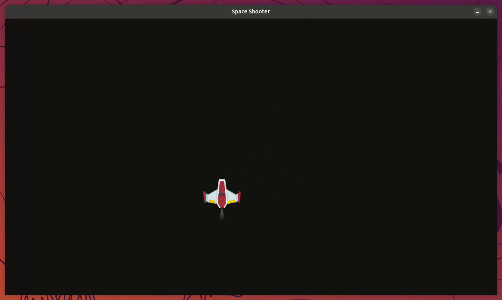

# Aufgabe 5 - Player & Projektile verwenden

Bisher ist unser "Spieler" nur ein lila Quadrat, das über eine lange Liste von Variablen  
(`square`, `square_rect`, `projectile_rects`, `last_shot`, ...) direkt in `main.py` gesteuert wird.  
Ein echtes Raumschiff mit Bewegung, Schuss-Cooldown, Leben und Bild selbst zu bauen, wäre an dieser Stelle sehr  
viel Python auf einmal. Dafür bekommst du ab jetzt ein fertiges Package: `space-game-entities`.



> [!NOTE] Info:
>
> `space-game-entities` stellt dir `Player`, `Projectile` und (ab [Aufgabe 6](../exercise-06/README.md)) `Asteroid` fertig zur Verfügung.  
> Du schreibst diese Klassen nicht selbst, sondern **verwendest** sie: importieren, erzeugen, in die Game Loop  
> einbinden. Das ist auch im echten Berufsleben ein riesiger Teil der Arbeit. Fertige Bausteine sinnvoll  
> kombinieren, statt alles von Grund auf neu zu erfinden.
>
> Ein `Player` ist dabei ein **Objekt**: ein Bild (`player.image`), eine Position (`player.rect`) und Fähigkeiten
> wie `player.update()` sind darin gebündelt. Du musst dafür nicht wissen, **wie** diese Klasse innen aufgebaut ist,
> nur **was** sie kann.

## Schritt 1 - Einstellungen zentral auslagern

Bevor wir das Package einbinden, lagern wir ein paar grundlegende Werte aus `main.py` in eine eigene Datei  
`settings.py` aus.

`settings.py`

```python
from pathlib import Path

# Assets Pfad
ASSETS_PATH = Path(__file__).joinpath("..", "..", "assets").resolve()
# Fenstergröße festlegen
WINDOW_WIDTH, WINDOW_HEIGHT = 1280, 720
# Framerate Limit
FRAMERATE = 60
```

> [!NOTE] Info:
>
> Wenn du deinen Code später mit der Musterlösung in `solution/` vergleichst: Dort steht bei `ASSETS_PATH`  
> **vier** Mal `".."`, weil die Musterlösung tiefer im Ordnerbaum liegt (`exercises/exercise-05/solution/`).  
> Dein eigener Code in `game/` braucht nur **zwei** `".."`: von `settings.py` aus einmal hoch in den  
> `game/`-Ordner, noch einmal hoch in den Projekt-Root - und von dort in `assets/`.

Passe `main.py` entsprechend an:

```diff
+ import settings
  import pygame

  # Grundlegendes Setup
  pygame.init()

- # Fenstergröße festlegen und Fenster erstellen
- WINDOW_WIDTH, WINDOW_HEIGHT = 1280, 720
- display_surface = pygame.display.set_mode((WINDOW_WIDTH, WINDOW_HEIGHT))
+ # Fenster erstellen
+ display_surface = pygame.display.set_mode(
+     (settings.WINDOW_WIDTH, settings.WINDOW_HEIGHT)
+ )

  # Fenstertitel setzen
  pygame.display.set_caption("Space Shooter")

- # Framerate und Clock definieren
+ # Clock definieren
  clock = pygame.time.Clock()
- FRAMERATE = 60
  delta_time = 0
```

Auch das Quadrat nutzt die Fenstergröße - stelle es ebenfalls auf `settings` um:

```diff
  # Quadrat definieren
  square = pygame.Surface((200, 200))
  square.fill("#7d37f0")
  square_rect = square.get_frect()
- square_rect.center = (WINDOW_WIDTH / 2, WINDOW_HEIGHT / 2)
+ square_rect.center = (settings.WINDOW_WIDTH / 2, settings.WINDOW_HEIGHT / 2)
```

Und ganz unten in der Game Loop:

```diff
    # 6. Framerate limitieren und Delta Time berechnen
-   delta_time = clock.tick(FRAMERATE) / 1000  # ms -> Sekunden
+   delta_time = clock.tick(settings.FRAMERATE) / 1000  # ms -> Sekunden
```

> [!NOTE] Info:
>
> `ASSETS_PATH` zeigt auf den `assets/`-Ordner im Projekt-Root, egal von wo aus du `main.py` startest.  
> Wir brauchen ihn gleich, damit `space-game-entities` weiß, wo die Bilder für Schiff und Projektil liegen.

## Schritt 2 - Package konfigurieren

`space-game-entities` muss einmalig wissen, wo der `assets/`-Ordner liegt. Ergänze das direkt nach `pygame.init()`:

```diff
  import settings
  import pygame
+ import space_game_entities

  # Grundlegendes Setup
  pygame.init()
+
+ # Mixer initialisieren (Player lädt bereits jetzt einen Schuss-Sound)
+ pygame.mixer.init()
+
+ # space-game-entities mitteilen, wo die Assets liegen
+ space_game_entities.configure(settings.ASSETS_PATH)
```

> [!IMPORTANT] Wichtig:
>
> `Player` lädt in seinem Konstruktor bereits einen Sound für den Laser-Schuss - dafür muss `pygame.mixer.init()`  
> vorher aufgerufen worden sein, sonst gibt es einen Fehler. Mehr zum Mixer und eigenen Sounds erfährst du in  
> [Aufgabe 8](../exercise-08/README.md).

## Schritt 3 - Das Quadrat durch den Player ersetzen

Jetzt tauschen wir unser Quadrat gegen einen echten `Player`:

```diff
  import settings
  import pygame
  import space_game_entities
+ from space_game_entities import Player

  # {...}

- # Quadrat definieren
- square = pygame.Surface((200, 200))
- square.fill("#7d37f0")
- square_rect = square.get_frect()
- square_rect.center = (settings.WINDOW_WIDTH / 2, settings.WINDOW_HEIGHT / 2)
+ # Spieler initialisieren
+ player = Player((settings.WINDOW_WIDTH / 2, settings.WINDOW_HEIGHT / 2))
```

Innerhalb der Game Loop ersetzt du die komplette Tastenabfrage (Bewegung **und** Schießen) durch einen einzigen  
Aufruf. `Player` kümmert sich intern schon um Bewegung, Bildschirmbegrenzung und Schießen (inklusive Cooldown).  
Die Leertasten-Abfrage muss dabei mit raus, denn sie greift noch auf das gerade gelöschte `square_rect` zu:

```diff
    # 3. Spiellogik aktualisieren
-   keys = pygame.key.get_pressed()
-
-   # Tasten-Abfrage, um Quadrat zu bewegen
-   if keys[pygame.K_w]:
-       square_rect.y -= 600 * delta_time
-   if keys[pygame.K_s]:
-       square_rect.y += 600 * delta_time
-   if keys[pygame.K_a]:
-       square_rect.x -= 600 * delta_time
-   if keys[pygame.K_d]:
-       square_rect.x += 600 * delta_time
-
-   # Tasten-Abfrage, um Projektil zu erstellen
-   if keys[pygame.K_SPACE]:
-       current_time = pygame.time.get_ticks()  # in ms
-
-       if current_time - last_shot >= 500:
-           temp = projectile.get_frect(midbottom=(square_rect.midtop))
-           projectile_rects.append(temp)
-           last_shot = current_time
+   player.update(delta_time)

    # Projektile bewegen
    for projectile_rect in projectile_rects:
        projectile_rect.y -= 800 * delta_time
```

Und in Schritt 4 (Rendering):

```diff
    # 4. Objekte auf der Zeichenfläche zeichnen (Rendering)
    for projectile_rect in projectile_rects:
        display_surface.blit(projectile, projectile_rect)

-   display_surface.blit(square, square_rect)
+   display_surface.blit(player.image, player.rect)
```

> [!TIP] Tipp:
>
> **▶ Führe das Spiel jetzt aus:** Du solltest ein Raumschiff sehen, das sich mit WASD bewegt und beim Verlassen  
> des Bildschirms auf der gegenüberliegenden Seite wieder auftaucht. Schießen funktioniert intern auch schon  
> (bei Leertaste hörst du den Laser-Sound) - sichtbar werden die Schüsse aber erst im nächsten Schritt.

## Schritt 4 - Die manuelle Projektil-Liste entfernen

`Player` erzeugt beim Drücken von Leertaste bereits selbst ein `Projectile` (inklusive Cooldown). Wir müssen nur  
noch die dazugehörige **[Sprite-Gruppe](https://www.pygame.org/docs/ref/sprite.html#pygame.sprite.Group)** `projectiles` importieren und in der Game Loop updaten/zeichnen.  
Die alte, manuelle Liste `projectile_rects` können wir samt Bewegung und Aufräum-Zeile komplett entfernen. Sogar das  
Entfernen unsichtbarer Projektile übernimmt das Package: Ein `Projectile` löscht sich selbst, sobald es den  
Bildschirm verlässt.

```diff
  import space_game_entities
- from space_game_entities import Player
+ from space_game_entities import Player, projectiles

  # {...}

- # Projektil definieren
- projectile = pygame.Surface((10, 40))
- projectile.fill("#4deeea")
- projectile_rects = []
- last_shot = pygame.time.get_ticks()  # in ms
-
  # Spieler initialisieren
  player = Player((settings.WINDOW_WIDTH / 2, settings.WINDOW_HEIGHT / 2))
```

```diff
    # 3. Spiellogik aktualisieren
+   projectiles.update(delta_time)
    player.update(delta_time)

-   # Projektile bewegen
-   for projectile_rect in projectile_rects:
-       projectile_rect.y -= 800 * delta_time
-
-   # Projektile außerhalb des Bildschirms entfernen
-   projectile_rects = [rect for rect in projectile_rects if rect.bottom > 0]
-
    # 4. Objekte auf der Zeichenfläche zeichnen (Rendering)
-   for projectile_rect in projectile_rects:
-       display_surface.blit(projectile, projectile_rect)
-
+   projectiles.draw(display_surface)
    display_surface.blit(player.image, player.rect)
```

> [!IMPORTANT] Wichtig:
>
> Beachte die Reihenfolge: `player.update(delta_time)` muss **vor** dem Zeichnen aufgerufen werden, damit ein  
> gerade abgefeuertes Projektil auch schon zur Gruppe `projectiles` gehört, wenn `projectiles.draw()` läuft.

> [!TIP] Tipp:
>
> **▶ Führe das Spiel erneut aus:** Mit Leertaste sollten jetzt wieder Laser abgefeuert werden. Der Code dafür  
> steckt komplett in `Player`, du musst dich um nichts mehr selbst kümmern.

## Bonus: Anderes Schiff, andere Werte

`Player` lässt sich beim Erzeugen mit ein paar Werten anpassen, ganz ohne den Package-Code selbst zu ändern.  
`ship` und `color` sind dabei keine einfachen Strings, sondern `Enum`-Werte. Importiere `ShipType` und `ShipColor`  
zusammen mit `Player`:

```diff
- from space_game_entities import Player, projectiles
+ from space_game_entities import Player, projectiles, ShipType, ShipColor
```

```python
player = Player(
    (settings.WINDOW_WIDTH / 2, settings.WINDOW_HEIGHT / 2),
    ship=ShipType.FIGHTER,     # ShipType.CLASSIC, ShipType.FIGHTER oder ShipType.STEALTH
    color=ShipColor.BLUE,      # ShipColor.RED, ShipColor.BLUE, ShipColor.GREEN oder ShipColor.ORANGE
    speed=600,                 # Pixel pro Sekunde
    cooldown=250,              # Millisekunden zwischen zwei Schüssen
)
```

> [!TIP] Tipp:
>
> Ein `Enum` bündelt eine feste Anzahl gültiger Werte unter einem Namen. Dein Editor kann dir dadurch beim  
> Tippen von `ShipType.` direkt alle erlaubten Optionen vorschlagen, und ein Tippfehler wie `"figher"` fällt  
> sofort auf statt erst zur Laufzeit als falsches Bild.

Probiere ein paar Kombinationen aus und finde deinen Favoriten. Das hat keinen Einfluss auf den Rest des Spiels.
