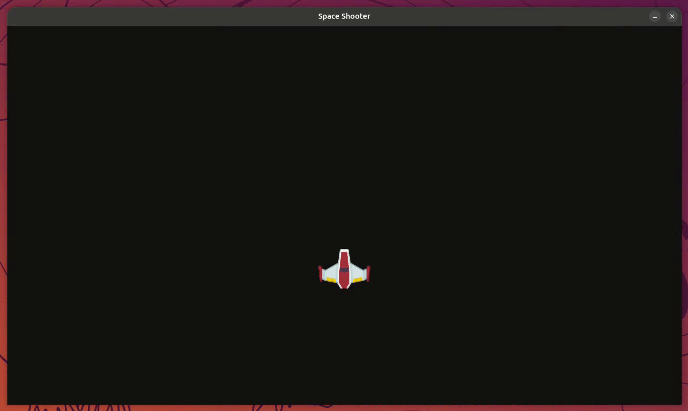

# Aufgabe 6 - Asteroiden verwenden

Jetzt bringen wir Gegner ins Spiel: Asteroiden, die von oben ins Bild fliegen. Genau wie `Player` bringt  
`space-game-entities` dafür eine fertige Klasse `Asteroid` mit. Inklusive zufälliger Größe und Farbe. Du musst  
dafür keine einzige Zeile Vektor-Mathematik selbst schreiben.



## Schritt 1 - Asteroiden importieren und erzeugen

Importiere `Asteroid` und die dazugehörige Sprite-Gruppe `asteroids`:

```diff
- from space_game_entities import Player, projectiles
+ from space_game_entities import Player, projectiles, Asteroid, asteroids
```

Erzeuge zum Testen einmalig einen Asteroiden direkt nach der Spieler-Initialisierung:

```diff
  # Spieler initialisieren
  player = Player((settings.WINDOW_WIDTH / 2, settings.WINDOW_HEIGHT / 2))
+
+ # Testweise einen Asteroiden erzeugen
+ Asteroid()
```

Und binde die Gruppe `asteroids` genau wie `projectiles` in Schritt 3 (Spiellogik) und Schritt 4 (Rendering)  
der Game Loop ein:

```diff
    # 3. Spiellogik aktualisieren
    projectiles.update(delta_time)
+   asteroids.update(delta_time)
    player.update(delta_time)
```

```diff
    # 4. Objekte auf der Zeichenfläche zeichnen (Rendering)
    projectiles.draw(display_surface)
+   asteroids.draw(display_surface)
    display_surface.blit(player.image, player.rect)
```

> [!TIP] Tipp:
>
> **▶ Führe das Spiel jetzt aus:** Ein einzelner Asteroid sollte von oben ins Bild fliegen und irgendwann den  
> Bildschirm nach unten verlassen (er entfernt sich dann automatisch selbst).

> [!NOTE] Info:
>
> Jeder `Asteroid()` bekommt automatisch eine zufällige Größe (`med`/`big`) und Farbe  
> (grau/braun) sowie eine zufällige Position, Richtung und Geschwindigkeit. Kleinere Asteroiden sind dabei  
> etwas schneller als große. Führe das Spiel mehrmals aus, um die Varianten zu sehen.

## Schritt 2 - Asteroiden regelmäßig nachspawnen

Ein einzelner Asteroid ist noch kein Spiel. Wir wollen, dass **regelmäßig** neue erscheinen. Das Prinzip kennst  
du bereits aus [Aufgabe 4](../exercise-04/README.md): Dort hast du mit `pygame.time.get_ticks()` einen Cooldown  
gebaut, damit nicht bei jedem Frame ein neues Projektil entsteht. Genau dieses Muster wenden wir jetzt auf  
Asteroiden an.

Ersetze den testweisen einmaligen `Asteroid()`-Aufruf:

```diff
  # Spieler initialisieren
  player = Player((settings.WINDOW_WIDTH / 2, settings.WINDOW_HEIGHT / 2))
-
- # Testweise einen Asteroiden erzeugen
- Asteroid()
+
+ # Asteroid Hilfsvariablen
+ last_asteroid_spawn = 0
+ asteroid_cooldown = 1000  # in ms
```

**Aufgabe:** Versuche jetzt selbst, in Schritt 3 (Spiellogik) der Game Loop eine Cooldown-Abfrage zu bauen, die  
alle `asteroid_cooldown` Millisekunden einen neuen `Asteroid()` erzeugt. Orientiere dich an der Schuss-Abfrage,  
die du in Aufgabe 4 geschrieben hast.

<details>
<summary>

#### Lösung

</summary>

```diff
    # 3. Spiellogik aktualisieren
    projectiles.update(delta_time)
    asteroids.update(delta_time)
    player.update(delta_time)
+
+   current_time = pygame.time.get_ticks()
+   if current_time - last_asteroid_spawn >= asteroid_cooldown:
+       Asteroid()
+       last_asteroid_spawn = current_time
```

> [!NOTE] Info:
>
> Die Position im Code spielt hier keine große Rolle - Hauptsache, die Abfrage läuft einmal pro Frame irgendwo  
> innerhalb von Schritt 3 (Spiellogik), also **vor** dem Rendering in Schritt 4.

</details>

> [!TIP] Tipp:
>
> **▶ Führe das Spiel jetzt aus:** Alle `asteroid_cooldown` Millisekunden sollte ein neuer Asteroid mit zufälliger  
> Größe, Farbe, Position und Geschwindigkeit erscheinen.

## Bonus: Für Fortgeschrittene

Falls du neugierig bist, wie `Player` und `Asteroid` intern aufgebaut sind: Der komplette Quellcode liegt lokal  
im Projekt unter `packages/space-game-entities/src/space_game_entities/`. Du musst dort nichts ändern, aber ein  
Blick hinein zeigt dir, wie die Konzepte aus den vorherigen Aufgaben (Klassen, Vektoren, Sprite-Gruppen) in einem  
etwas größeren, "echten" Stück Code zusammenspielen.
