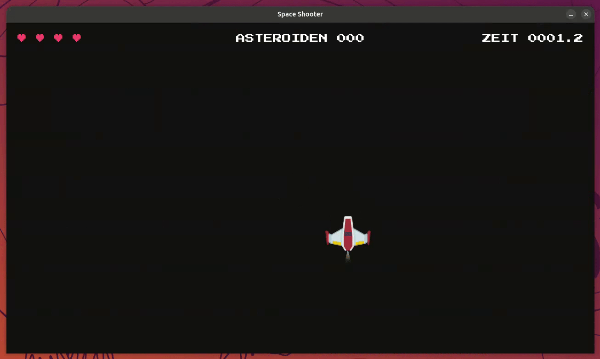
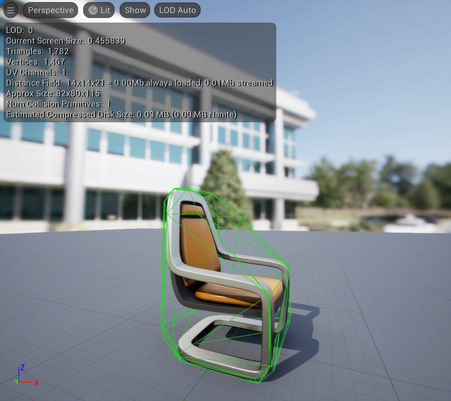

# Aufgabe 7 - Kollisionen

In diesem Modul bringen wir Logik in unser Spiel:
Wir kümmern uns um Kollisionen zwischen Spieler, Projektilen und Asteroiden – und sorgen dafür, dass sich keine Objekte endlos im Weltall verirren.
Außerdem führen wir ein neues Feature ein: Leben für den Spieler!



## Schritt 1 - Wie prüft man Kollisionen?

#### 1. Rechteck-Kollision (`Rect`)

Die Rect-Kollision nutzt `.rect`-Attribute von Sprites, um einfache Überschneidungen zu erkennen.  
Das ist sehr performant und somit ideal für einfache Formen!


#### 2. Pixelgenaue Kollision (`Mask`)

Mit `pygame.mask` kann man eine Art Schablone aus der Oberfläche erzeugen, um wirklich Pixel-Perfect zu erkennen, ob zwei Sprites sich überschneiden.  
Dieses Verfahren ist sehr genau, aber dafür deutlich rechenintensiver!


#### 3. Polygon/Mesh-Kollision (3D Engines)

In komplexeren Game Engines (z.B. Unreal Engine) werden oft sogenannte Mesh-Kollisionen verwendet. Sie sind ideal für unregelmäßige Formen in 3D-Spielen.



> [!NOTE] Info:
>
> Für unseren Space Shooter reichen uns aktuell `rect`-basierte Kollision völlig aus!

## Schritt 2 - Projektile treffen Asteroiden

Wir möchten erreichen, dass Projektile Asteroiden zerstören können.  
Beide liegen bereits in eigenen Sprite-Gruppen: `projectiles` und `asteroids`.

Normalerweise müssten wir hier z.B. über die Gruppen `projectiles` und `asteroids` iterieren, um herauszufinden, welche rects kollidieren.

Beispiel mit [colliderect()](https://pyga.me/docs/ref/rect.html#pygame.Rect.colliderect):

```python
for projectile in projectiles:
    for asteroid in asteroids:
        if projectile.rect.colliderect(asteroid.rect):
            projectile.kill()
            asteroid.kill()
```

Eine weitere Möglichkeit wäre [collidelist()](https://pyga.me/docs/ref/rect.html#pygame.Rect.collidelist):
Hier wird direkt der erste Treffer als Index zurückgegeben (oder `-1`, falls keine Kollision vorliegt).

```python
for projectile in projectiles:
    asteroid_rects = [asteroid.rect for asteroid in asteroids]
    collision_index = projectile.rect.collidelist(asteroid_rects)
    if collision_index != -1:
        projectile.kill()
        asteroids.sprites()[collision_index].kill()
```

> [!TIP] Tipp:
>
> Beide Beispiele sind bewusst nicht ideal (siehe unten) und müssen nicht abgetippt werden.  
> Sie zeigen nur, wie man es **ohne** die speziellen Sprite-Gruppen-Methode lösen müsste.

Aber da wir schon Sprites verwenden, diese in Sprite-Gruppen speichern, sind die oben gezeigten Varianten nicht gerade ideal, denn für Sprite-Gruppen gibt es deutlich bessere Ansätze, die uns genau diese Arbeit abnehmen!

Nutze hierfür die eingebaute Methode [pygame.sprite.groupcollide()](https://pyga.me/docs/ref/sprite.html#pygame.sprite.groupcollide).  
Sie prüft, ob sich Sprites aus zwei Gruppen überschneiden, und übernimmt dabei optional auch gleich das Entfernen der beteiligten Sprites:

```python
pygame.sprite.groupcollide(
    projectiles,     # Gruppe A
    asteroids,       # Gruppe B
    True,            # Projektil entfernen -> projectile.kill()
    True             # Asteroid entfernen  -> asteroid.kill()
)
```

Wir fügen folgendes in Schritt 3 (Spiellogik) der Game Loop von `main.py` ein:

```diff
  # 3. Spiellogik aktualisieren
+ # Kollision: Projektile <-> Asteroiden
+ pygame.sprite.groupcollide(projectiles, asteroids, True, True)

  projectiles.update(delta_time)
  asteroids.update(delta_time)
  player.update(delta_time)
```

> [!NOTE] Info:
>
> Das ist jetzt schon mal cool, aber was bringt es dem Spieler jetzt, wenn wir gar nicht zählen, wie viele Asteroiden er zerstört hat?


#### Score pro zerstörtem Asteroiden hinzufügen

Das ist im Endeffekt sehr einfach: Unser `Player` bringt das Attribut `player.asteroids_destroyed` bereits fertig  
mit (Startwert `0`). Wir müssen es nur noch erhöhen, wenn ein Projektil einen Asteroiden trifft.

**Praktisch:** `groupcollide()` gibt uns dafür schon alles zurück, was wir brauchen. Nämlich ein **Dictionary**,  
das jedem Projektil, das etwas getroffen hat, die **Liste** der dabei getroffenen Asteroiden zuordnet.  
So können wir jeden zerstörten Asteroiden einzeln zählen - auch wenn in einem einzigen Frame mehrere  
gleichzeitig getroffen werden.

<details>
<summary>

#### Lösung

</summary>

`main.py`

```diff
   # Kollision: Projektile <-> Asteroiden
-  pygame.sprite.groupcollide(projectiles, asteroids, True, True)
+ projectile_asteroid_collisions = pygame.sprite.groupcollide(
+     projectiles, asteroids, True, True
+ )
+ for destroyed_asteroids in projectile_asteroid_collisions.values():
+     player.asteroids_destroyed += len(destroyed_asteroids)
```

> [!TIP] Tipp:
>
> Du kannst dir zum Testen auch den Score nach dem Erhöhen ausgeben lassen, z.B. mit `print(f"Score: {player.asteroids_destroyed}")`

</details>

## Schritt 3 - Spieler trifft auf Asteroid

Auch der Spieler sollte mit Asteroiden kollidieren können und dabei Leben verlieren. `player.lives` existiert bei  
unserem `Player` ebenfalls schon fertig (Startwert `4`). Wir müssen in der `main.py`, in der Game Loop, nur noch  
prüfen, ob der `player` mit der Gruppe `asteroids` kollidiert.  
Hierfür verwenden wir [pygame.sprite.spritecollide()](https://pyga.me/docs/ref/sprite.html#pygame.sprite.spritecollide).

<details>
<summary>

#### Lösung

</summary>

`main.py`:

```python
# Kollision: Spieler <-> Asteroiden
if pygame.sprite.spritecollide(player, asteroids, dokill=True):
    player.lives -= 1
```

> [!IMPORTANT] Wichtig:
>
> `dokill` bezieht sich hier auf Objekte aus der Gruppe, nicht auf das Sprite `player`!

Aber nur das reicht nicht, denn wenn der Spieler keine Leben mehr hat, sollten wir `running = False` setzen, damit das Spiel beendet wird, oder ein Death-Screen angezeigt wird.

```diff
  # Kollision: Spieler <-> Asteroiden
  if pygame.sprite.spritecollide(player, asteroids, dokill=True):
      player.lives -= 1
+     if player.lives == 0:
+         running = False
```

</details>

#### Werte im Blick behalten mit `debug()`

Leben und Score ständig über `print()` in der Konsole zu verfolgen, ist auf Dauer unpraktisch. Viel schöner  
wäre es, beides direkt im Spielfenster zu sehen. Genau dafür gibt es im Package `space-game-utils` die fertige  
Funktion `debug(text, x=10, y=10)`: Sie zeichnet den übergebenen Text als weißen Text auf einem schwarzen  
Kasten an eine beliebige Bildschirmposition, damit er auf jedem Hintergrund lesbar bleibt.

Importiere sie oben in `main.py`:

```diff
  import settings
  import pygame
  import space_game_entities
  from space_game_entities import Player, projectiles, Asteroid, asteroids
+ from space_game_utils import debug
```

Und rufe sie am Anfang von Schritt 3 (Spiellogik) der Game Loop auf:

```diff
  # 3. Spiellogik aktualisieren
+ debug(f"Lives: {player.lives}")
+ debug(f"Asteroids: {player.asteroids_destroyed}", y=40)
```

> [!TIP] Tipp:
>
> **▶ Führe das Spiel jetzt aus:** Oben links solltest du jetzt deine Leben und den Score sehen. Beides  
> aktualisiert sich sofort, wenn du Asteroiden triffst oder getroffen wirst. In Schritt 5 ersetzen wir diese  
> provisorische Anzeige durch ein richtiges HUD.

## Schritt 4 - Objekte außerhalb des Bildschirms, Bildschirmbegrenzung

In einem selbstgebauten Spiel müsstest du jetzt noch dafür sorgen, dass Projektile und Asteroiden sich außerhalb  
des Bildschirms selbst entfernen (sonst wird die Gruppe immer größer und das Spiel langsamer), und dass der  
Spieler beim Verlassen des Bildschirms auf der gegenüberliegenden Seite wieder auftaucht.

> [!NOTE] Info:
>
> **Gute Nachricht:** Das übernehmen `Player`, `Projectile` und `Asteroid` aus `space-game-entities` bereits  
> automatisch für dich. Du hast das schon in Aufgabe 5 und 6 gesehen, ohne dass du dafür extra Code schreiben  
> musstest. An dieser Stelle gibt es für dich also nichts mehr zu tun.

## Schritt 5 - HUD anzeigen

Jetzt, wo wir Leben und zerstörte Asteroiden zählen, wollen wir das hübsch für den Spieler sichtbar  
machen und das zusammen mit der Zeit, die er schon überlebt hat. Dafür bekommst du eine fertige Funktion  
`draw_hud()`, genau wie `debug()`, die du eben schon benutzt hast, aus dem Package `space-game-utils`.

Anders als `debug()` braucht `draw_hud()` ein Asset (die Pixel-Font aus `assets/fonts/`). Ergänze dafür  
einmalig direkt nach dem Setup:

```diff
  import settings
  import pygame
  import space_game_entities
+ import space_game_utils
  from space_game_entities import Player, projectiles, Asteroid, asteroids
  from space_game_utils import debug

  # Grundlegendes Setup
  pygame.init()

  # Mixer initialisieren (Player lädt bereits jetzt einen Schuss-Sound)
  pygame.mixer.init()

- # space-game-entities mitteilen, wo die Assets liegen
+ # space-game-entities und space-game-utils mitteilen, wo die Assets liegen
  space_game_entities.configure(settings.ASSETS_PATH)
+ space_game_utils.configure(settings.ASSETS_PATH)
```

> [!NOTE] Info:
>
> `draw_hud(lives, asteroids_destroyed, time_lived)` stellt Leben als Herzen (♥) statt als Zahl dar, und  
> jeder Wert (Herzen, Asteroiden, Zeit) hat eine **feste** Position (links, mittig, rechts) statt in einem  
> gemeinsamen, mittig zentrierten Text zu stehen. Zusammen mit einer **Festbreitenschrift** (Pixel-Font)  
> sorgt das dafür, dass die Anzeige nicht "springt", wenn z. B. die Sekunden hochzählen und dadurch mehr  
> Ziffern brauchen.
>
> `debug(text, x=10, y=10)` schreibt Text an eine beliebige Bildschirmposition. Das ist praktisch zum schnellen  
> Testen von Werten während der Entwicklung, wird aber fürs eigentliche HUD nicht mehr gebraucht.

Zuerst messen wir, wie lange der Spieler schon überlebt hat. Ergänze direkt nach der Spieler-Initialisierung:

```diff
  # Spieler initialisieren
  player = Player((settings.WINDOW_WIDTH / 2, settings.WINDOW_HEIGHT / 2))

+ # Zeitpunkt merken, an dem das Spiel gestartet ist
+ game_start_time = pygame.time.get_ticks()
```

Und berechnen daraus in jedem Frame die vergangene Zeit in Sekunden, in Schritt 3 (Spiellogik). Die beiden  
provisorischen `debug()`-Aufrufe aus Schritt 3 brauchen wir jetzt nicht mehr. Zeichne das HUD danach in  
Schritt 4 (Rendering), zusammen mit den anderen Objekten:

```diff
  # 3. Spiellogik aktualisieren
+ time_lived = (pygame.time.get_ticks() - game_start_time) / 1000
- debug(f"Lives: {player.lives}")
- debug(f"Asteroids: {player.asteroids_destroyed}", y=40)

  # 4. Objekte auf der Zeichenfläche zeichnen (Rendering)
  projectiles.draw(display_surface)
  asteroids.draw(display_surface)
  display_surface.blit(player.image, player.rect)
+ draw_hud(player.lives, player.asteroids_destroyed, time_lived)
```

Und ersetze den `debug`-Import oben in `main.py` durch `draw_hud`:

```diff
  from space_game_entities import Player, projectiles, Asteroid, asteroids
- from space_game_utils import debug
+ from space_game_utils import draw_hud
```

> [!TIP] Tipp:
>
> **▶ Führe das Spiel jetzt aus:** Oben links siehst du deine Leben als Herzen, mittig die zerstörten Asteroiden  
> und rechts die überlebte Zeit. Keiner der drei Werte sollte "hin und her springen", während die Zahlen wachsen.
