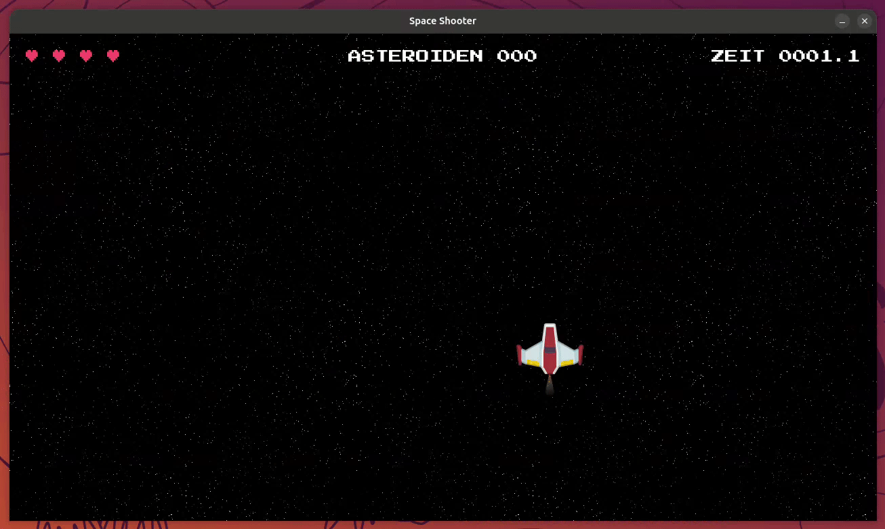

# Aufgabe 8 - Sounds, Musik & Hintergrund

`Player`, `Projectile` und `Asteroid` bringen ihre Texturen, Varianten und sogar den Schuss-Sound schon fertig  
mit. In diesem Modul geht es um die **Umgebung** drumherum: einen  
kachelbaren Sternenhimmel als Hintergrund, Hintergrundmusik und Soundeffekte, die wir direkt in `main.py` bei  
Kollisionen auslösen.



> [!TIP] Tipp:
>
> Dieses Modul dient lediglich als Anhaltspunkt.  
> Du kannst gerne andere Sounds und Musik aus `assets/` verwenden!

## Schritt 1 - Hintergrundbild hinzufügen

Unsere Anwendung wirkt langsam deutlich mehr wie ein Spiel, aber der einfarbige Hintergrund  
liefert noch kein "Weltraum-Feeling". In `assets/images/background/starfield/` findest du kleine, kachelbare  
Sternenhimmel-Texturen (`tile_1.png` bis `tile_4.png`).

> [!NOTE] Info:
>
> Ein einzelnes Tile ist deutlich kleiner als unser Fenster (1280 × 720) und müsste mehrfach nebeneinander  
> und untereinander gezeichnet werden, um den ganzen Bildschirm zu füllen. Diese Kachel-Logik selbst zu schreiben  
> wäre an dieser Stelle zu aufwändig, deshalb bekommst du dafür die fertige Funktion `load_background()` aus dem  
> Package `space-game-utils` (genau wie `debug()`, siehe [Aufgabe 7](../exercise-07/README.md)).

Lade den Hintergrund einmalig vor der Game Loop in `main.py`:

```python
from space_game_utils import load_background

# {...}

background = load_background(
    settings.ASSETS_PATH / "images" / "background" / "starfield" / "tile_1.png"
)
```

Und zeichne ihn als erstes in Schritt 2 (Zeichenfläche zurücksetzen), statt die Zeichenfläche einfarbig zu füllen:

```diff
  while running:
      # {...}
-     # 2. Zeichenfläche zurücksetzen
-     display_surface.fill("#121212")
+     # 2. Zeichenfläche zurücksetzen
+     display_surface.blit(background)
```

> [!TIP] Tipp:
>
> **▶ Führe das Spiel jetzt aus:** Statt der einfarbigen Fläche solltest du jetzt einen kachelbaren Sternenhimmel sehen.

## Schritt 2 - Hintergrundmusik einfügen

Jetzt laden wir eine Musikdatei und lassen sie im Hintergrund spielen:

```python
game_music = pygame.mixer.Sound(
    settings.ASSETS_PATH / "music" / "synthwave" / "loop_7.mp3"
)
game_music.set_volume(0.5)
game_music.play(loops=-1, fade_ms=1000)
```

> [!NOTE] Info:
>
> `set_volume(0.5)`: Setzt die Lautstärke der Musik auf `0.5` (akzeptiert Werte zwischen `0.0` und `1.0`)  
> `loops=-1`: Bedeutet, dass die Musik endlos wiederholt werden soll

## Schritt 3 - Soundeffekte für Kollisionen

Zwei weitere Sounds runden das Spielgefühl ab: ein Einschlag-Sound bei Kollisionen und ein Alarm, wenn dem  
Spieler nur noch ein Leben bleibt. Lade beide zusammen mit der Musik in `main.py`:

```diff
  game_music.play(loops=-1, fade_ms=1000)
+
+ alarm = pygame.mixer.Sound(settings.ASSETS_PATH / "sounds" / "alarm" / "loop_3.wav")
+ alarm.set_volume(0.3)
+
+ impact = pygame.mixer.Sound(settings.ASSETS_PATH / "sounds" / "impact" / "blast_1.wav")
+ impact.set_volume(0.5)
```

Spiele `impact` ab, sobald eine Kollision zwischen Projektil und Asteroid stattfindet:

```diff
  # Kollision: Projektile <-> Asteroiden
  projectile_asteroid_collisions = pygame.sprite.groupcollide(
      projectiles, asteroids, True, True
  )
  for destroyed_asteroids in projectile_asteroid_collisions.values():
      player.asteroids_destroyed += len(destroyed_asteroids)
+     impact.play()
```

Und ergänze bei der Kollision zwischen Spieler und Asteroid sowohl `impact` als auch `alarm`, wenn nur noch ein  
Leben übrig ist:

```diff
  # Kollision: Spieler <-> Asteroiden
  if pygame.sprite.spritecollide(player, asteroids, dokill=True):
      player.lives -= 1
+     impact.play()
      if player.lives == 0:
          running = False
+     elif player.lives == 1:
+         alarm.play()
```

> [!NOTE] Info:
>
> Da `Player` bei sinkenden Leben automatisch eine Schadensanzeige auf dem Schiff einblendet (probier es aus!),  
> bekommst du optisches **und** akustisches Feedback.

> [!TIP] Tipp:
>
> **▶ Führe das Spiel jetzt aus:** Bei Treffern solltest du jetzt Sound hören, und beim letzten Leben zusätzlich  
> den Alarm.
