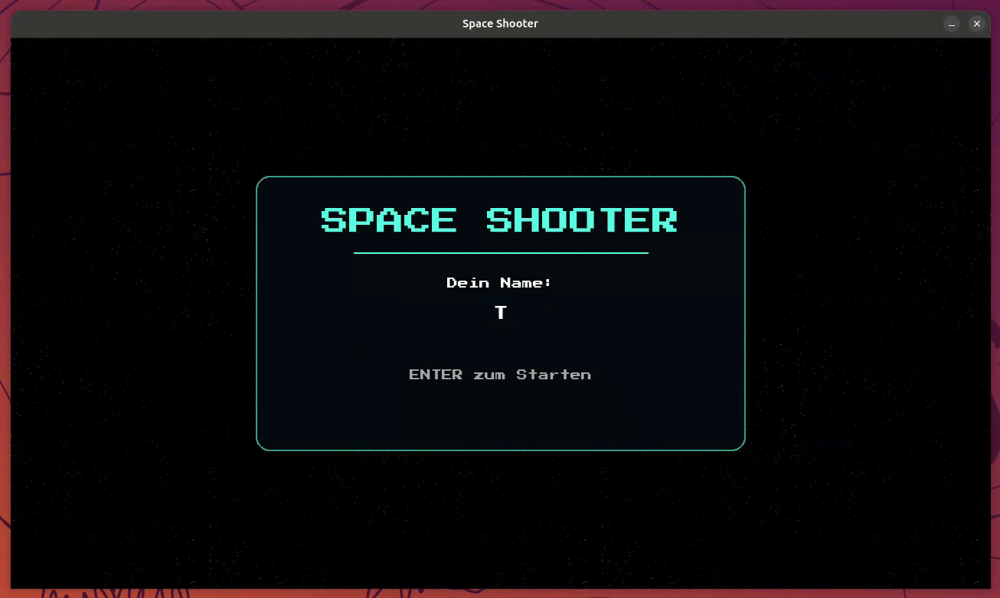

# Aufgabe 10 - Start-, Pause- und Death-Screen

Bisher startet unser Spiel direkt in die Game Loop, es gibt keine Möglichkeit zu pausieren  
und wenn der Spieler stirbt, schließt sich das Fenster einfach. In diesem Modul rüsten wir  
unser Spiel mit einem Start-, Pause- und Death-Screen aus, inklusive Menü-Musik und einem  
Bestätigungston für Enter/Q/Esc.



> [!NOTE] Info:
>
> Ein eigenes Menü-System selbst zu bauen (Buttons, Texteingabe, Übergänge zwischen Bildschirmen) wäre an  
> dieser Stelle sehr aufwändig. Deshalb bekommst du dafür das fertige Package `space-game-ui`.  
> Es ist bereits über den `pyproject.toml`-Workspace als Abhängigkeit eingebunden.

## Schritt 1 - Das `Menu`-Objekt erstellen

`space-game-ui` stellt eine Klasse `Menu` bereit, die drei fertige Bildschirme mitbringt:  
`start_screen()`, `pause_screen()` und `death_screen()`.

Genau wie `space-game-entities` (siehe [Aufgabe 5](../exercise-05/README.md)) muss `space-game-ui` einmalig  
wissen, wo der `assets/`-Ordner liegt. Dort liegen die Pixel-Font und die Menü-Sounds. Ergänze dafür oben  
in `main.py` die Imports und direkt nach den anderen `configure()`-Aufrufen den neuen Aufruf:

```diff
  import httpx
  import pygame
  import settings
  import space_game_entities
+ import space_game_ui
  import space_game_utils
  from space_game_entities import Player, projectiles, Asteroid, asteroids
  from space_game_utils import load_background, get_device_id, ApiClient, draw_hud
+ from space_game_ui import Menu
```

```diff
- # space-game-entities und space-game-utils mitteilen, wo die Assets liegen
+ # space-game-entities, space-game-ui und space-game-utils mitteilen, wo die Assets liegen
  space_game_entities.configure(settings.ASSETS_PATH)
+ space_game_ui.configure(settings.ASSETS_PATH)
  space_game_utils.configure(settings.ASSETS_PATH)
```

> [!IMPORTANT] Wichtig:
>
> `Menu` spielt selbst schon Sounds ab (Menü-Musik im Startbildschirm, ein Bestätigungston bei `Enter` / `Q` / `Esc`).  
> Dafür muss der Mixer bereitstehen, **bevor** `Menu` erzeugt wird. Das passt schon: `pygame.mixer.init()`  
> rufen wir seit [Aufgabe 6](../exercise-06/README.md) direkt nach `pygame.init()` auf, also lange bevor wir  
> gleich das `Menu` erzeugen. Nur den Kommentar dort passen wir an den neuen Grund an:
>
> ```diff
> - # Mixer initialisieren (Player lädt bereits jetzt einen Schuss-Sound)
> + # Mixer initialisieren (Menu spielt bereits eigene Sounds, Player einen Schuss-Sound)
>   pygame.mixer.init()
> ```

Jetzt können wir das `Menu`-Objekt erzeugen. Der Sternenhimmel-Hintergrund aus  
[Aufgabe 8](../exercise-08/README.md) dient dabei gleich auch als Kulisse für den Startbildschirm -  
das halten wir im Kommentar fest und erzeugen das `Menu` direkt danach:

```diff
- # Hintergrund laden
+ # Hintergrund laden (auch als Kulisse für den Startbildschirm)
  background = load_background(
      settings.ASSETS_PATH / "images" / "background" / "starfield" / "tile_1.png"
  )
+
+ # Menu vorbereiten
+ menu = Menu(display_surface)
```

## Schritt 2 - Startbildschirm statt Konsolen-Eingabe

In [Aufgabe 9](../exercise-09/README.md) haben wir den Spielernamen noch über `input()` in der Konsole abgefragt.  
Das ersetzen wir jetzt durch `menu.start_screen()`. Sie zeigt einen Titel, ein Eingabefeld für den Namen  
und läuft so lange, bis der Spieler `ENTER` drückt oder das Fenster schließt - dabei läuft im Hintergrund  
die Menü-Musik, und beim Bestätigen mit `ENTER` hörst du den Bestätigungston.

Rufe den Startbildschirm direkt nach dem Erzeugen des `Menu` auf - **bevor** Sounds, Spieler und API  
vorbereitet werden, denn all das brauchen wir erst, wenn wirklich gespielt wird:

```diff
  # Menu vorbereiten
  menu = Menu(display_surface)
+
+ # Startbildschirm anzeigen und Namen abfragen
+ player_name = menu.start_screen(background=background)
```

Die alte Konsolen-Abfrage im API-Block weiter unten kannst du jetzt entfernen:

```diff
  api_client = ApiClient(settings.API_BASE_URL)
  device_id = get_device_id(settings.ASSETS_PATH / ".." / "device_id.txt")
- player_name = input("Wie lautet dein Name? ")
```

> [!NOTE] Info:
>
> `menu.start_screen()` gibt den eingegebenen Namen als `str` zurück - oder `None`, falls der Spieler  
> das Fenster direkt geschlossen hat. Diesen Fall müssen wir behandeln, denn ohne Namen ergibt es keinen Sinn,  
> einen Spieler bei der API anzulegen oder die Game Loop überhaupt zu starten. Das `background` sorgt dafür,  
> dass im Hintergrund der Sternenhimmel statt einer leeren Fläche zu sehen ist - genau wie bei `pause_screen()`  
> und `death_screen()` weiter unten.

Statt dafür den kompletten restlichen Code (Sounds bis Game Loop) einzurücken, brechen wir mit einer kleinen  
Prüfung direkt danach ab, falls kein Name eingegeben wurde:

```diff
  player_name = menu.start_screen(background=background)
+
+ if player_name is None:
+     pygame.quit()
+     raise SystemExit
```

> [!TIP] Tipp:
>
> Das nennt man eine **Guard Clause**: Statt den kompletten restlichen Code in ein `if` zu verschachteln,  
> beendet man das Programm sofort, wenn eine Bedingung nicht erfüllt ist. Der restliche Code bleibt dadurch  
> auf der gleichen Einrückungsebene wie bisher - du musst also nichts umformatieren, was bei so einer großen  
> Codemenge sehr fehleranfällig wäre (schnell vergisst man eine Zeile oder verrutscht in der Einrückung).  
> `raise SystemExit` beendet das Programm, `pygame.quit()` sorgt vorher noch für eine saubere Freigabe der  
> pygame-Ressourcen.

> [!TIP] Tipp:
>
> **▶ Führe das Spiel jetzt aus:** Statt der Konsolen-Frage solltest du jetzt einen Startbildschirm mit  
> Sternenhimmel-Kulisse, Titel, Namenseingabe und Menü-Musik sehen. Bestätige mit `ENTER` - du solltest den  
> Bestätigungston hören und die Musik sollte enden, sobald die Game Loop startet.

## Schritt 3 - Pausieren mit ESC

Als Nächstes soll der Spieler das Spiel mit `ESC` pausieren können. Ergänze das in Schritt 1 (Events) der Game Loop.  
**Aufgabe:** Probiere es zuerst selbst, bevor du unten nachschaust.

<details>
<summary>

#### Lösung

</summary>

```diff
    # 1. Eingaben (Events) abfragen
    for event in pygame.event.get():
        if event.type == pygame.QUIT:
            running = False
+       if event.type == pygame.KEYDOWN and event.key == pygame.K_ESCAPE:
+           if not menu.pause_screen(background=display_surface.copy()):
+               running = False
```

</details>

> [!NOTE] Info:
>
> `display_surface.copy()` erstellt eine Kopie des aktuellen Bildes. `pause_screen()` zeichnet diese Kopie im  
> Hintergrund abgedunkelt, sodass man noch erkennt, wo man pausiert hat.  
> `menu.pause_screen()` gibt `True` zurück, wenn weitergespielt werden soll (Taste `ESC`), und `False`,  
> wenn der Spieler das Spiel beenden möchte (Taste `Q`) - für beide hörst du den Bestätigungston.

Testest du das jetzt, fällt schnell ein Problem auf: Nach dem Fortsetzen bewegen sich Asteroiden und Projektile  
manchmal ruckartig nach vorne, und man kann sofort getroffen werden, direkt nachdem man die Pause verlassen hat.

> [!IMPORTANT] Wichtig:
>
> **Grund:** `delta_time` misst die Zeit zwischen zwei `clock.tick()`-Aufrufen. `pause_screen()` blockiert mit  
> einer **eigenen** Clock, die `delta_time` gar nicht kennt - die komplette Pausendauer (auch wenn sie mehrere  
> Sekunden dauert) fließt dadurch in den **nächsten** `delta_time`-Wert nach dem Fortsetzen ein. Bei einem so  
> großen `delta_time` bewegen sich Asteroiden, Projektile und Spieler in einem einzigen Frame so weit, wie sie  
> es sonst über die ganze Pausendauer verteilt getan hätten - und das kann eine Kollision auslösen, bevor du  
> überhaupt reagieren kannst.
>
> **Lösung:** Setze die Clock direkt nach dem Fortsetzen einmal zurück, indem du `clock.tick()` **ohne**  
> Framerate-Argument aufrufst - das misst die vergangene Zeit nur, um sie zu verwerfen, und begrenzt die  
> Framerate nicht zusätzlich.

```diff
        if event.type == pygame.KEYDOWN and event.key == pygame.K_ESCAPE:
            if not menu.pause_screen(background=display_surface.copy()):
                running = False
+           clock.tick()  # Pause nicht in die nächste Delta Time einrechnen
```

Zusätzlich soll die Spielmusik während der Pause nicht in voller Lautstärke weiterlaufen. Dimme sie vor  
`pause_screen()` und stelle die ursprüngliche Lautstärke danach wieder her:

```diff
        if event.type == pygame.KEYDOWN and event.key == pygame.K_ESCAPE:
+           game_music.set_volume(GAME_MUSIC_VOLUME * 0.2)
            if not menu.pause_screen(background=display_surface.copy()):
                running = False
+           game_music.set_volume(GAME_MUSIC_VOLUME)
            clock.tick()  # Pause nicht in die nächste Delta Time einrechnen
```

Damit `GAME_MUSIC_VOLUME` als fester Wert zur Verfügung steht, ersetze bei der Sound-Initialisierung:

```diff
  game_music = pygame.mixer.Sound(
      settings.ASSETS_PATH / "music" / "synthwave" / "loop_7.mp3"
  )
- game_music.set_volume(0.5)
+ GAME_MUSIC_VOLUME = 0.5
+ game_music.set_volume(GAME_MUSIC_VOLUME)
  game_music.play(loops=-1, fade_ms=1000)
```

Ein letztes Zeit-Problem derselben Sorte bleibt noch: `time_lived` berechnen wir aus  
`pygame.time.get_ticks() - game_start_time` - und `get_ticks()` läuft während der Pause einfach weiter.  
Wer lange pausiert, bekommt die Pausendauer also als "überlebte Zeit" ins HUD (und später in den API-Score)  
geschenkt. Die Lösung funktioniert wie beim `delta_time`-Sprung: Wir merken uns vor dem Pause-Screen, wann  
die Pause begonnen hat, und schieben `game_start_time` danach um die Pausendauer nach vorne - damit ist die  
Pause aus der Rechnung wieder herausgekürzt:

```diff
        if event.type == pygame.KEYDOWN and event.key == pygame.K_ESCAPE:
            game_music.set_volume(GAME_MUSIC_VOLUME * 0.2)
+           pause_started = pygame.time.get_ticks()
            if not menu.pause_screen(background=display_surface.copy()):
                running = False
            game_music.set_volume(GAME_MUSIC_VOLUME)
+           game_start_time += pygame.time.get_ticks() - pause_started
            clock.tick()  # Pause nicht in die nächste Delta Time einrechnen
```

> [!TIP] Tipp:
>
> **▶ Führe das Spiel jetzt aus:** Mit `ESC` sollte jetzt ein abgedunkelter Pause-Bildschirm über deinem  
> laufenden Spiel erscheinen, während die Musik leiser wird. Nach dem Fortsetzen sollte nichts mehr springen  
> oder sofort treffen, egal wie lange du pausiert hast - und die Zeit oben rechts im HUD sollte genau dort  
> weiterlaufen, wo sie beim Pausieren stehen geblieben ist.

## Schritt 4 - Death-Screen statt direktem Spielende

Bisher haben wir das Spiel bei `player.lives == 0` einfach über `running = False` beendet.  
Jetzt zeigen wir stattdessen `menu.death_screen()` mit dem finalen Score an.

<details>
<summary>

#### Lösung

</summary>

```diff
    if pygame.sprite.spritecollide(player, asteroids, dokill=True):
        player.lives -= 1
        impact.play()
        if player.lives == 0:
            running = False

            if player_id is not None:
                try:
                    api_client.submit_score(
                        player_id, player.asteroids_destroyed, time_lived
                    )
                except httpx.HTTPError:
                    print("Score konnte nicht gesendet werden.")
+
+           menu.death_screen(
+               player.asteroids_destroyed,
+               time_lived,
+               background=display_surface.copy(),
+           )
        elif player.lives == 1:
            alarm.play()
```

</details>

> [!NOTE] Info:
>
> `time_lived` berechnen wir schon seit [Aufgabe 7](../exercise-07/README.md) jeden Frame fürs HUD - genau  
> diesen Wert können wir hier auch für den Death-Screen weiterverwenden.

### Ein eigener Sound für den Tod

Aktuell hört man beim Sterben nur noch `impact.play()` aus der Kollision - und falls du gerade erst auf `1`  
Leben gefallen bist, spielt `alarm` (16 Sekunden lang!) einfach ungestört weiter, während `menu.death_screen()`  
schon längst auf dem Bildschirm steht. Zusätzlich spielt `menu.death_screen()` selbst schon die Menü-Musik ab  
(dieselbe wie im Startbildschirm) - läuft `game_music` parallel weiter, überlagern sich zwei Musikstücke.

Lade dafür einen weiteren Sound zusammen mit den anderen:

```diff
  impact = pygame.mixer.Sound(settings.ASSETS_PATH / "sounds" / "impact" / "blast_1.wav")
  impact.set_volume(0.5)
+
+ death_sound = pygame.mixer.Sound(settings.ASSETS_PATH / "sounds" / "impact" / "loose_1.wav")
+ death_sound.set_volume(0.2)
```

Und stoppe `alarm` sowie `game_music`, bevor der Death-Screen erscheint:

```diff
        if player.lives == 0:
            running = False
+
+           alarm.stop()
+           game_music.stop()
+           death_sound.play()

            if player_id is not None:
```

> [!NOTE] Info:
>
> `.stop()` beendet einen laufenden Sound sofort, egal wie lange er noch gegangen wäre - wichtig für `alarm`,  
> da der sonst noch munter weiterläuft, während du längst auf dem Death-Screen bist.

Testest du das jetzt, siehst du nach dem Schließen des Death-Screens kurz noch einmal das Schiff und die  
Asteroiden aufblitzen, bevor sich das Fenster schließt - nicht schön.

> [!IMPORTANT] Wichtig:
>
> **Grund:** `running = False` beendet die Game Loop erst bei der **nächsten** Prüfung von `while running`.  
> Der aktuelle Schleifendurchlauf läuft nach `menu.death_screen()` ganz normal weiter - Schritt 4 (Rendering)  
> zeichnet Asteroiden, Projektile und Schiff also noch ein letztes Mal, **nachdem** der Death-Screen schon  
> geschlossen wurde.
>
> **Lösung:** Springe direkt nach `menu.death_screen()` mit `continue` zurück zum Schleifenanfang - das  
> überspringt den Rest des aktuellen Durchlaufs (Rendering, `flip()`, `tick()`) komplett, `while running`  
> beendet die Schleife dann sofort.

```diff
            menu.death_screen(
                player.asteroids_destroyed,
                time_lived,
                background=display_surface.copy(),
            )
+           continue
        elif player.lives == 1:
            alarm.play()
```

> [!TIP] Tipp:
>
> **▶ Führe das Spiel jetzt aus:** Verliere alle Leben - statt dass sich das Fenster schließt, solltest du  
> jetzt einen Death-Screen mit deinem finalen Score sehen, und das Fenster schließt sich direkt danach, ohne  
> noch einmal das laufende Spiel zu zeigen. Du solltest den Death-Sound hören, danach die Menü-Musik - `alarm`  
> und `game_music` sollten dabei komplett verstummt sein, auch wenn du kurz vorher erst auf `1` Leben gefallen bist.

## Bonus: Neustart nach dem Death-Screen

`menu.death_screen()` gibt `True` zurück, wenn der Spieler auf dem Death-Screen `ENTER` drückt, also ein neues  
Spiel starten möchte, und `False`, wenn er das Spiel beenden möchte. Aktuell ignorieren wir diesen Rückgabewert  
noch und beenden das Spiel immer - obwohl der Death-Screen bereits `ENTER = Neustart` verspricht.

Werte den Rückgabewert aus: Nur bei `False` beenden wir das Spiel wie bisher über `running = False`. Bei `True`  
leeren wir stattdessen das Spielfeld und setzen den Spielzustand auf den Anfang zurück - die Game Loop läuft  
danach einfach weiter, und die nächste Runde beginnt:

```diff
        if player.lives == 0:
-           running = False
-
            alarm.stop()
            game_music.stop()
            death_sound.play()

            if player_id is not None:
                try:
                    api_client.submit_score(
                        player_id, player.asteroids_destroyed, time_lived
                    )
                except httpx.HTTPError:
                    print("Score konnte nicht gesendet werden.")

-           menu.death_screen(
+           if menu.death_screen(
                player.asteroids_destroyed,
                time_lived,
                background=display_surface.copy(),
-           )
+           ):
+               # Neue Runde: Spielfeld leeren und Spielzustand zurücksetzen
+               asteroids.empty()
+               projectiles.empty()
+               player = Player(
+                   (settings.WINDOW_WIDTH / 2, settings.WINDOW_HEIGHT / 2)
+               )
+               game_start_time = pygame.time.get_ticks()
+               last_asteroid_spawn = 0
+               game_music.play(loops=-1, fade_ms=1000)
+               clock.tick()  # Death-Screen nicht in die nächste Delta Time einrechnen
+           else:
+               running = False
            continue
        elif player.lives == 1:
            alarm.play()
```

> [!NOTE] Info:
>
> - `asteroids.empty()` und `projectiles.empty()` entfernen alle Sprites aus der jeweiligen Gruppe - das Spielfeld ist danach leer.
> - Ein frisch erzeugter `Player` startet automatisch wieder mit vollen Leben und Score `0` in der Bildschirmmitte.
> - `game_start_time` und `last_asteroid_spawn` setzen Zeitmessung und Spawn-Rhythmus zurück, `game_music.play()` startet die Spielmusik neu.
> - `clock.tick()` verwirft die auf dem Death-Screen verbrachte Zeit, damit sie nicht in die nächste Delta Time einfließt - derselbe Trick wie beim Pause-Screen.

> [!TIP] Tipp:
>
> **▶ Führe das Spiel jetzt aus:** Verliere alle Leben und drücke auf dem Death-Screen `ENTER` - eine neue  
> Runde startet mit vollen Leben, Score `0` und leerem Spielfeld. Mit `ESC` (oder dem Schließen des Fensters)  
> beendet sich das Spiel wie bisher.
