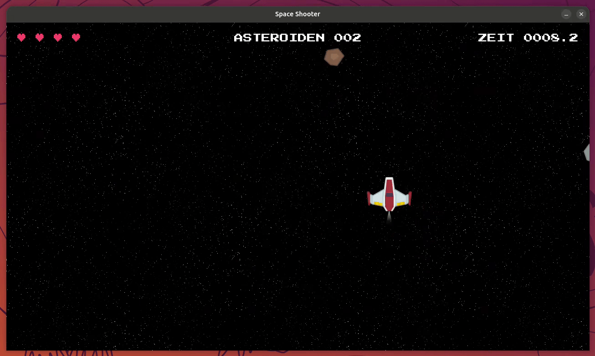

# Aufgabe 11 - Bonus: Echte Physik mit pymunk

> [!NOTE] Info:
>
> Dieses Modul ist **optional**. Es baut auf [Aufgabe 10](../exercise-10/README.md) auf und zeigt dir,  
> wie viel einfacher sich manche Dinge mit einer echten Physik-Engine lösen lassen. Für das Praktikum  
> selbst brauchst du es nicht - probiere es aus, wenn du fertig bist und noch Lust auf mehr hast!



## Schritt 1 - Das Problem: Asteroiden ignorieren sich gegenseitig

Aktuell bewegen sich unsere Asteroiden komplett unabhängig voneinander - sie fliegen einfach durcheinander,  
ohne sich gegenseitig wahrzunehmen. Damit sie sich wie feste Objekte verhalten und **voneinander abprallen**,  
bräuchten wir eine echte Kollisionsauflösung: Für jedes Asteroidenpaar müsste bei einer Berührung Masse,  
Geschwindigkeit und Aufprallwinkel berücksichtigt werden, um die neuen Geschwindigkeiten nach dem Stoß zu berechnen.

> [!NOTE] Info:
>
> Das selbst zu berechnen, wäre relativ aufwändige Vektor- und Impuls-Mathematik. Genau dafür gibt es  
> Physik-Engines wie [pymunk](http://www.pymunk.org/) - sie übernehmen diese Berechnungen für uns.  
> Damit du die rohe pymunk-API dafür nicht lernen musst, gibt es das fertige Package `space-game-physics`.  
> Und damit du dafür auch nicht `Player` oder `Asteroid` selbst anpassen musst, bringen beide bereits einen  
> optionalen `physics_world`-Parameter mit - du musst nur noch eine `PhysicsWorld` erzeugen und übergeben.

## Schritt 2 - Physik-Welten erzeugen

`space-game-physics` stellt eine Klasse `PhysicsWorld` bereit. Sie verwaltet im Hintergrund eine pymunk-Simulation  
und kümmert sich um alle Kollisionen zwischen den Objekten, die ihr hinzugefügt werden. Wir erzeugen zwei  
getrennte Welten - eine für die Asteroiden, eine für den Spieler - direkt nach der Clock:

```diff
  from space_game_entities import Player, projectiles, Asteroid, asteroids
+ from space_game_physics import PhysicsWorld
  from space_game_utils import load_background, get_device_id, ApiClient, draw_hud
```

```diff
  # Clock definieren
  clock = pygame.time.Clock()
  delta_time = 0
+
+ # Physik-Welten erzeugen
+ asteroid_world = PhysicsWorld()
+ player_world = PhysicsWorld(damping=0.15)
```

> [!NOTE] Info:
>
> `damping` steuert, wie viel von der aktuellen Geschwindigkeit eines Objekts **pro Sekunde übrig bleibt**:  
> `0` heißt sofort stoppen, `1` heißt ewig weitergleiten. Mit `damping=0.15` bremst das Schiff nach dem  
> Loslassen der Tasten also von selbst zügig ab - das macht es deutlich leichter kontrollierbar. Die  
> Asteroiden-Welt bekommt kein `damping`, ihre Brocken sollen ja ungebremst weiterfliegen.

> [!NOTE] Info:
>
> Warum zwei getrennte Welten statt einer gemeinsamen? Kollisionen zwischen Spieler und Asteroiden prüfen wir  
> bereits über `pygame.sprite.spritecollide()` (siehe [Aufgabe 7](../exercise-07/README.md)) - hier soll pymunk  
> nur für das Abprall-Verhalten der Asteroiden untereinander und das Drift-Gefühl des Spielers sorgen, nicht für  
> eine zusätzliche Kollisionsberechnung zwischen den beiden.

## Schritt 3 - Player und Asteroid an ihre Physik-Welt anbinden

Übergib die jeweilige `PhysicsWorld` beim Erzeugen:

```diff
  # Spieler initialisieren
- player = Player((settings.WINDOW_WIDTH / 2, settings.WINDOW_HEIGHT / 2))
+ player = Player(
+     (settings.WINDOW_WIDTH / 2, settings.WINDOW_HEIGHT / 2),
+     physics_world=player_world,
+ )
```

```diff
    current_time = pygame.time.get_ticks()
    if current_time - last_asteroid_spawn >= asteroid_cooldown:
-       Asteroid()
+       Asteroid(physics_world=asteroid_world)
        last_asteroid_spawn = current_time
```

## Schritt 4 - Die Simulationen in der Game Loop berechnen

Zuletzt müssen beide Welten in Schritt 3 (Spiellogik) der Game Loop jeden Frame einen Schritt weiterrechnen,  
bevor die Sprites aktualisiert werden:

```diff
    # 3. Spiellogik aktualisieren
+   # Physik-Simulationen einen Schritt weiter berechnen
+   asteroid_world.step(delta_time)
+   player_world.step(delta_time)
```

> [!TIP] Tipp:
>
> **▶ Führe das Spiel jetzt aus:** Asteroiden, die sich berühren, sollten sich jetzt wie feste Körper verhalten  
> und voneinander abprallen. Dein Schiff gleitet nach dem Loslassen der Tasten noch ein kleines Stück weiter  
> und bremst dabei dank `damping` von selbst ab - es fühlt sich also "physikalischer" an, bleibt aber gut  
> kontrollierbar. Beides hättest du von Hand nachzubauen deutlich mehr Aufwand gekostet - hier waren es nur  
> ein paar Zeilen in `main.py`.

## Schritt 5 - Neustart-Reset an die Physik anpassen

Falls du den [Neustart-Bonus aus Aufgabe 10](../exercise-10/README.md#bonus-neustart-nach-dem-death-screen)  
umgesetzt hast: Beim Zurücksetzen des Spielfelds müssen jetzt auch die Physik-Bodies aufgeräumt werden.  
Sonst simuliert pymunk die alten, unsichtbaren Objekte einfach weiter - und neue Asteroiden prallen  
scheinbar "an nichts" ab:

```diff
                # Neue Runde: Spielfeld leeren und Spielzustand zurücksetzen
-               asteroids.empty()
+               for asteroid in asteroids.sprites():
+                   asteroid.kill()  # räumt auch den Physik-Body aus der Welt
                projectiles.empty()
+               player_world.remove(player.physics_body)
                player = Player(
-                   (settings.WINDOW_WIDTH / 2, settings.WINDOW_HEIGHT / 2)
+                   (settings.WINDOW_WIDTH / 2, settings.WINDOW_HEIGHT / 2),
+                   physics_world=player_world,
                )
```

> [!NOTE] Info:
>
> `empty()` entfernt Sprites nur aus der Gruppe, ruft aber **nicht** deren `kill()`-Methode auf.  
> `Asteroid.kill()` entfernt neben dem Sprite auch dessen Physik-Body aus der `PhysicsWorld` - deshalb rufen  
> wir es jetzt für jeden Asteroiden einzeln auf. Den Body des alten Spielers entfernen wir per  
> `player_world.remove()`, bevor der neue `Player` seinen eigenen anlegt.

## Bonus: Für Fortgeschrittene

Neugierig, *wie* `Player` und `Asteroid` den `physics_world`-Parameter intern nutzen (z. B. `PhysicsBody`,  
Bildschirm-Wrap-Synchronisierung mit `sync_from_rect()`)? Schau dir den Quellcode unter  
`packages/space-game-entities/src/space_game_entities/` an - dort siehst du, wie die Konzepte aus dem  
[`space-game-physics`-Package](../../packages/space-game-physics/README.md) mit den Sprites zusammenspielen.  
Du musst dafür nichts ändern, ein Blick hinein ist aber ein guter nächster Schritt, falls du Lust hast,  
irgendwann selbst solche Klassen zu schreiben.
