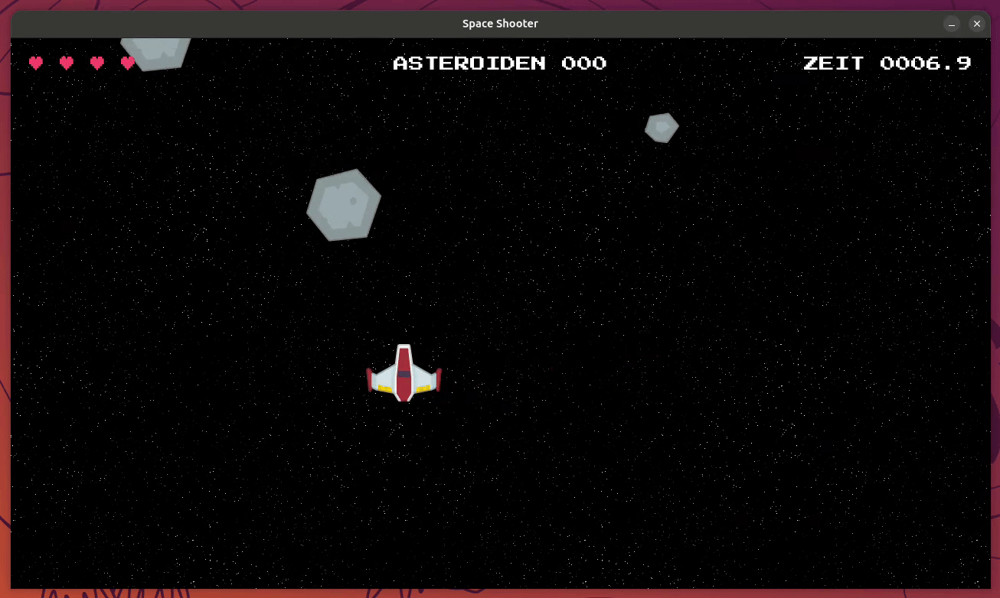

# Showcase - Erweiterte Version zum Spielen (kein Modul)

Dieser Ordner ist **kein** weiteres Modul, das absolviert werden soll. Es gibt hier nichts zu programmieren.
`solution/main.py` ist eine fertig ausprogrammierte, ausgebaute Version des Spiels, aufbauend auf
[Aufgabe 11](../exercise-11/README.md), gedacht zum **Anschauen und Spielen**, z. B. bei der gemeinsamen
Vorführung am Ende der Praktikumswoche oder danach.



> [!NOTE] Info:
>
> Alles hier basiert auf denselben Packages (`space-game-entities` & Co.) wie die Module 1-11. Die
> Erweiterungen sind so gebaut, dass sie das Verhalten der Module **nicht** verändern - `Asteroid`, `Player`
> und `Projectile` funktionieren in den Aufgaben 1-11 exakt wie bisher. Mehr Details dazu im
> [Package-README](../../packages/space-game-entities/README.md#bonus-explosion-enemy--asteroiden-splitting-nur-exercisesshowcase).

## Was ist neu, im Vergleich zu Aufgabe 11?

* **Schubdüsen-Animation** - Das Schiff zeigt jetzt eine kleine Flammen-Animation (`fire01` -> `fire02` ->
  `fire03`, geloopt) am Heck, sobald sich der Spieler bewegt, und ist aus, wenn er stillsteht. Das ist
  bereits automatisch in `Player` eingebaut - diesen Effekt siehst du also auch schon ab Aufgabe 5.
* **Explosionen** - Trifft ein Projektil einen Asteroiden oder Gegner, spielt an genau dieser Stelle ein
  kleiner Treffer-Effekt ab. Wird das getroffene Objekt dabei tatsächlich zerstört (Asteroid, Gegner - oder
  der Spieler selbst beim letzten Leben), erscheint stattdessen eine größere Explosion.
* **Asteroiden splitten sich** - Es gibt nur noch die Größen `big` (2 Treffer) und `med` (1 Treffer) -
  `small` wurde entfernt, da man diese kaum trifft. Wird `big` zerstört, zerspringt er dabei in zwei
  `med`-Asteroiden; `med` verschwindet beim Zerstören endgültig.
* **Gegnerische Schiffe** - Gelegentlich (höchstens zwei gleichzeitig) taucht ein gegnerisches Schiff auf,
  das oben im Bild patrouilliert, Asteroiden nach Möglichkeit ausweicht und ausschließlich senkrecht nach
  unten schießt (kein Zielen). Um den Spieler trotzdem treffen zu können, versucht es aktiv, sich horizontal
  über der Spielerposition zu positionieren. Es hält mehrere Treffer aus, ist aber bewusst nicht besonders
  stark (träger Cooldown, wenige Trefferpunkte) - der Fokus liegt auf den Asteroiden.

## Steuerung

Identisch zu Aufgabe 11: `WASD` zum Bewegen, `Leertaste` zum Schießen, `ESC` zum Pausieren.

## Ausführen

```sh
uv run exercises/showcase/solution/main.py
```

> [!TIP] Tipp:
>
> Neugierig, wie Explosion/Enemy/Asteroiden-Splitting funktionieren? Die entsprechenden Klassen liegen wie
> `Player`, `Projectile` und `Asteroid` unter
> `packages/space-game-entities/src/space_game_entities/` (`explosion.py`, `enemy.py`, die neue
> `take_damage()`-Methode in `asteroid.py`) - ein Blick hinein lohnt sich, wenn du mit Aufgabe 11 durch bist
> und sehen willst, wie so eine Erweiterung aufgebaut ist, ohne bestehenden Code zu verändern.
