#  Python Crashkurs – Modul 1: Einrichtung & erste Schritte

Bevor wir programmieren, richten wir unsere Arbeitsumgebung ein:  
Wir installieren **Python**, lernen den **Interpreter** kennen, richten **Visual Studio Code** ein und bereiten es für die Verwendung von **Jupyter Notebooks** vor, welche in den folgenden Modulen 2–7 verwendet werden.

## 1. Was ist Python?

**Python** ist eine Programmiersprache, die besonders **leicht zu lesen und zu verstehen** ist.  
Sie wurde so entwickelt, dass man sich auf die **Idee** hinter dem Code und nicht auf komplizierte Regeln konzentrieren kann.  
Viele lernen Python als ihre erste Programmiersprache, da sie einfach zu lernen ist.

## 2. Wo wird Python eingesetzt?

| Bereich                  | Beispiel                                |
| ------------------------ | --------------------------------------- |
| Webentwicklung           | YouTube, Instagram, Spotify             |
| Datenanalyse             | Wettervorhersage, Excel-Automatisierung |
| Machine Learning         | ChatGPT, Bild- & Spracherkennung        |
| Spieleentwicklung        | 2D-Games mit Pygame                     |
| Systemautomation         | Skripte für Linux oder Windows          |
| Wissenschaft & Forschung | Simulationen, Datenauswertung           |

## 3. Python auf Ubuntu installieren

1. Öffne ein Terminal (z.B. mit der Tastenkombination `STRG + ALT + T`)

    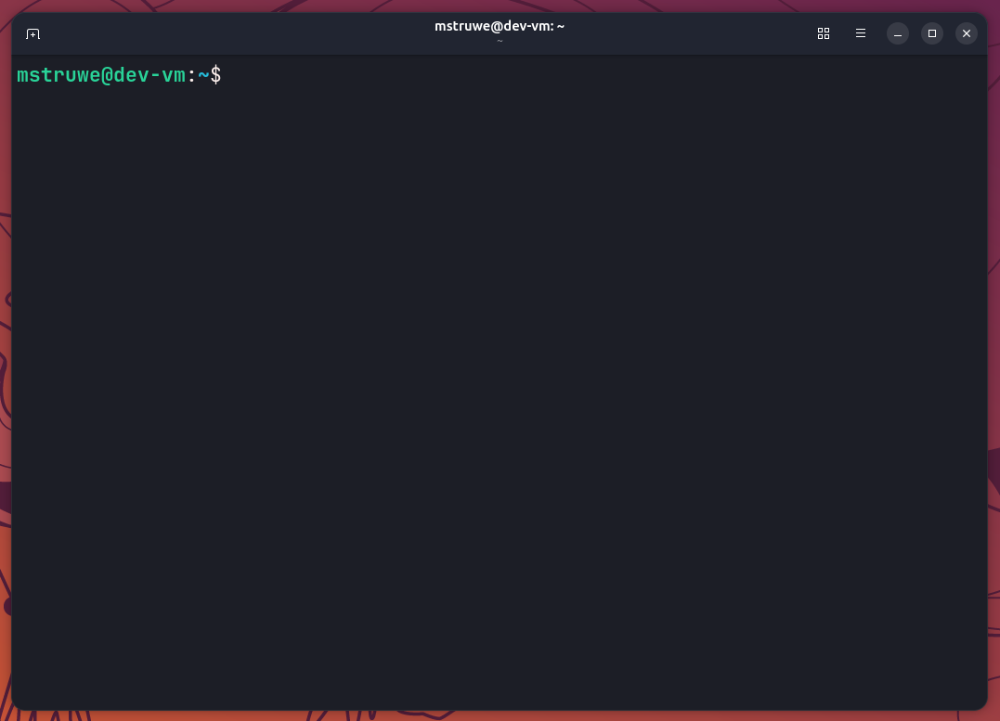

2. Prüfe, ob Python installiert ist:

    ```sh
    python3 --version
    ```

    Wenn du z. B. `Python 3.12.x` siehst, ist Python bereits installiert.  
    Falls **nicht**, installiere Python mit:

    ```sh
    sudo apt update
    sudo apt install python3
    ```

## 4. Der Python-Interpreter

Der **Interpreter** ist eine Testumgebung, in der man direkt Python-Befehle ausprobieren kann, ohne eine Datei erstellen zu müssen!

### 4.1 Interpreter starten

Starte ihn im Terminal mit:

```sh
python3
```

Jetzt kannst du direkt Befehle eingeben:

```sh
2 + 2       # 4
1 > 2       # False
"Hallo"     # 'Hallo'
```

### 4.2 Was passiert bei einem Fehler?

```py
2 +         # SyntaxError!
```

> [!NOTE] Info:
>
> **Syntax** ist die "Grammatik" einer Programmiersprache.  
> Python versteht hier nicht, was wir meinen, da ein Teil der Aussage fehlt!

### 4.3 Interpreter beenden

```py
exit()
```

Oder mit der Tastenkombination `STRG` + `D`.

## 5. Entwicklungsumgebung: Visual Studio Code

Der Interpreter ist super für schnelle Tests, aber für richtige Programme brauchen wir eine Entwicklungsumgebung.  
Dafür nutzen wir [VS Code](https://code.visualstudio.com/).

### 5.1 VS Code installieren

1. Gehe auf: https://code.visualstudio.com/
2. Lade die `.deb`-Datei für Ubuntu herunter
3. Installiere sie per Doppelklick oder über das Terminal:

    ```sh
    sudo apt install ~/Downloads/<name>.deb
    ```

## 6. Das erste Python-Projekt

1. Öffne VS Code und klicke auf `Continue without Signing In`

    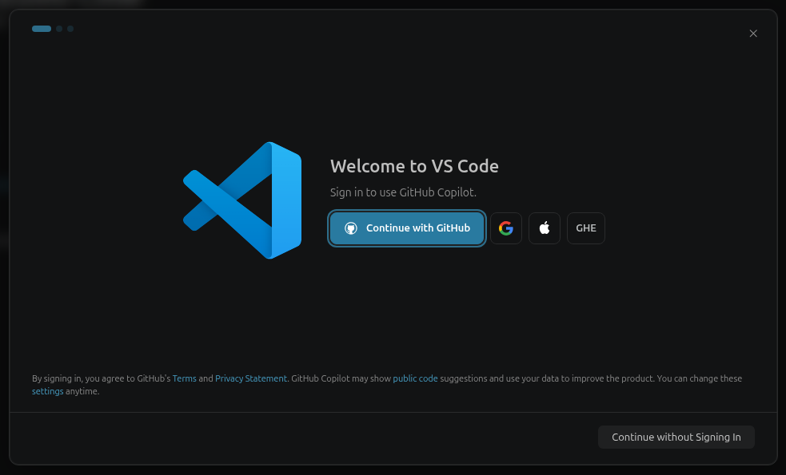

2. Wähle eine der vorgeschlagenen Farbpaletten aus und klicke auf `Continue`

    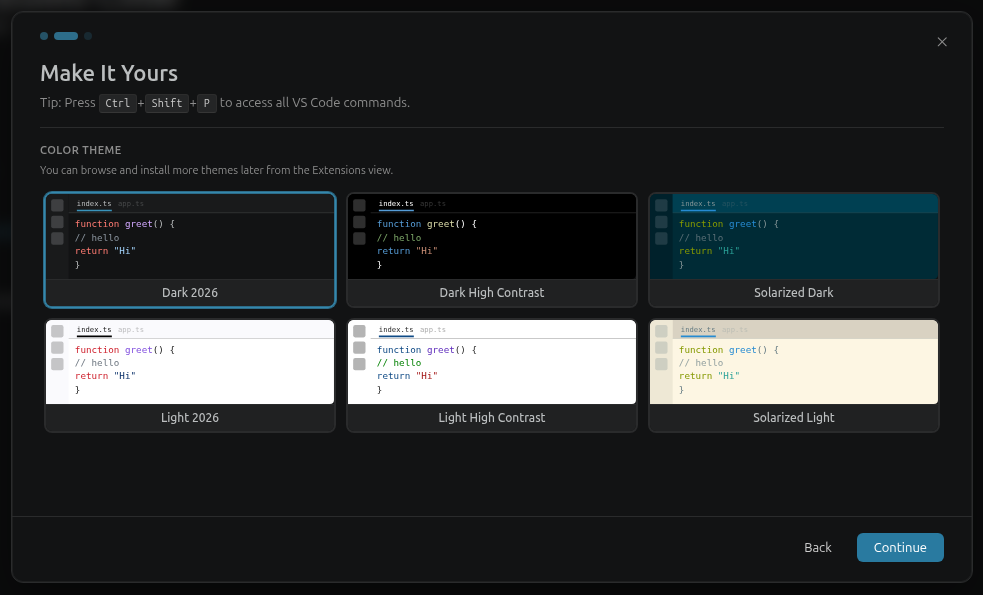

3. Öffne einen Projektordner (z.B. mit `STRG` + `K`, dann `STRG` + `O`)

    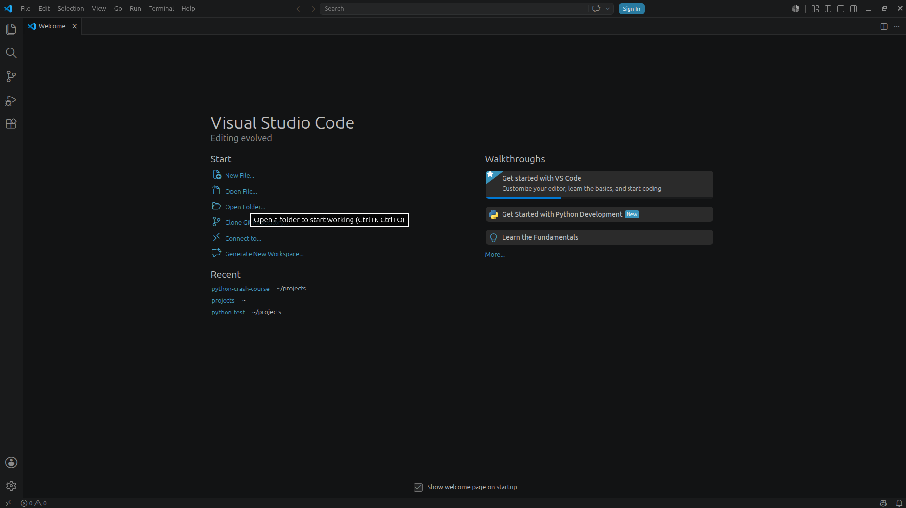

4. Erstelle einen neuen Ordner (z.B. `praktikum`) und klicke `Auswählen` / `Select`

    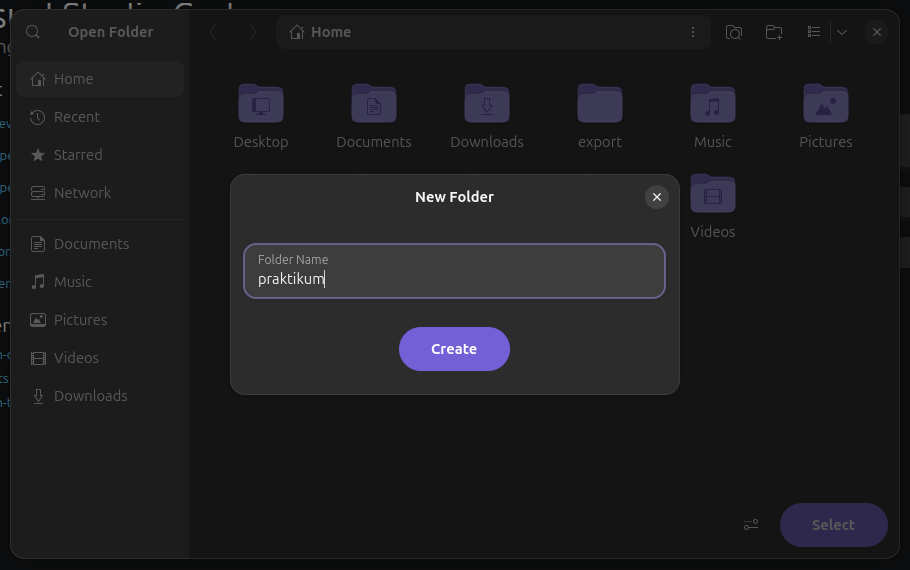

5. Klicke auf `Restricted Mode`

    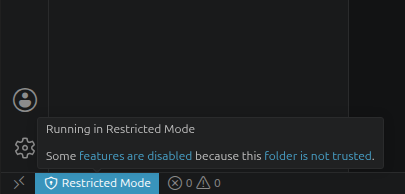

6. Klicke auf `Trust`

    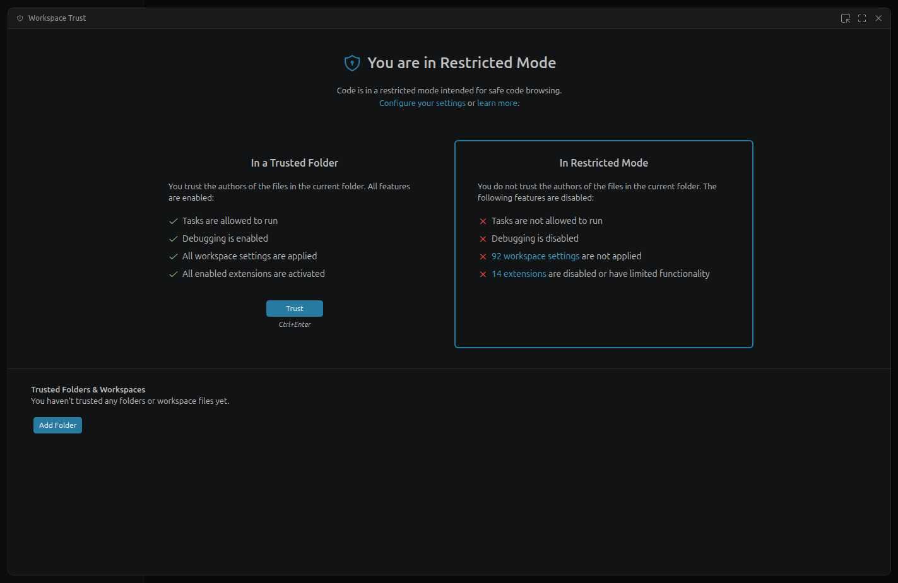


7. Erstelle darin eine neue Datei mit dem Namen `main.py`

    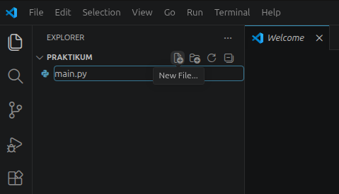

8. Schreibe in die Datei:

    ```py
    print("Hello world!")
    ```

### 6.1 Code ausführen

```sh
python3 main.py
```

Oder später auch über das ▶️-Symbol oben rechts in VS Code.

> [!TIP] Tipp:
>
> Wenn kein Terminal sichtbar ist, gehe auf `Terminal > Neues Terminal` im oberen Menüband.
> Alternativ kannst du mit `STRG` + `SHIFT` + `~` ein Terminal innerhalb VS Code öffnen.

## 7. Linter & Formatter

Beim Schreiben von Code können schnell kleine Fehler passieren:

```py
print "Hello world!"    # SyntaxError!
```

Das merkt man oft erst beim Ausführen.  
**Besser:** VS Code zeigt uns Fehler direkt beim Schreiben. Dafür brauchen wir einen **Linter** sowie **Formatter**.

### 7.1 Was ist ein Linter?

Ein **Linter** überprüft unseren Code automatisch auf:

* Fehler (z.B. fehlende Klammern)
* Warnungen (z.B. unsaubere Benennung)
* Style-Regeln (z.B. Einrückung)

### 7.2 Was ist ein Formatter?

Ein **Formatter** sorgt dafür, dass unser Code einheitlich und ordentlich formatiert wird, damit auch andere Entwickler daran arbeiten können.

### 7.3 Erweiterungen installieren

1. Öffne die Erweiterungsseite z.B. mit `STRG` + `SHIFT` + `X`
2. Suche nach `Ruff` und klicke auf **Installieren** (`Trust Publisher & Install`)

    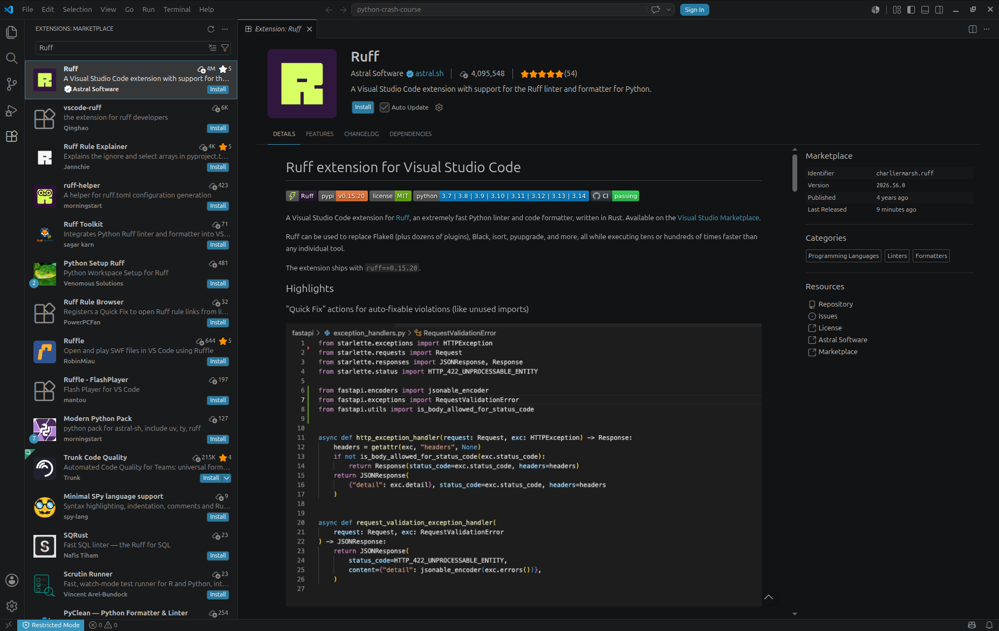

    > [!NOTE] Info:
    >
    > Neben der `Ruff`-Extension wird auch eine `Python`-Extension, sowie `Pylance` (Linter) automatisch installiert.

    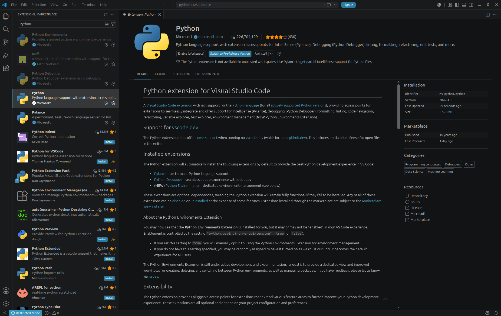

### 7.4 VS Code richtig einrichten

1. Klicke unten links auf das `Zahnrad -> Einstellungen`

    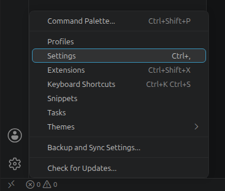

2. Language Server setzen:

    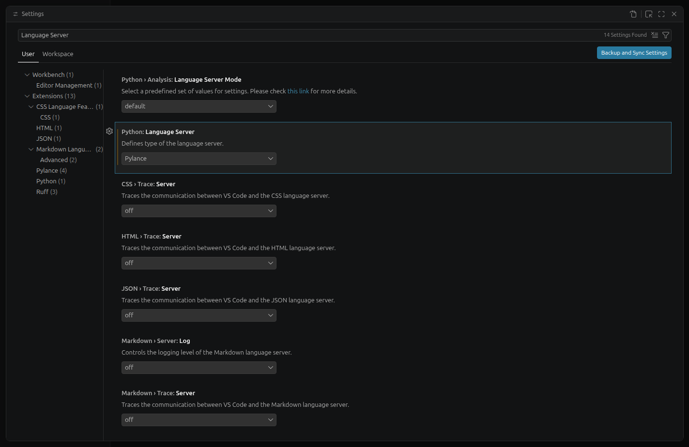

3. Formatter setzen und automatische Formatierung beim Speichern aktivieren:

    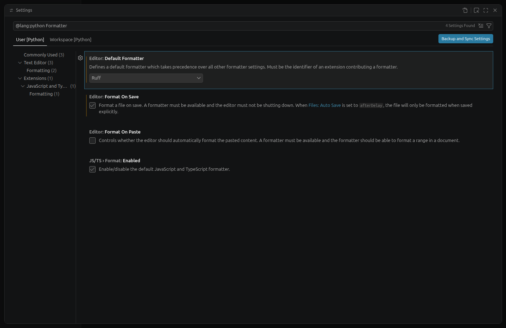

4. Funktionen wie `print()` direkt mit Klammern bei Autovervollständigungen versehen:

    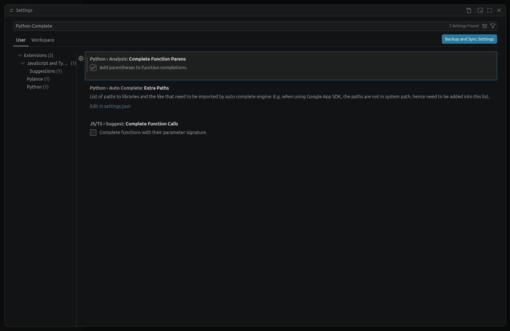

Nachdem wir die Einstellungen übernommen haben, sollte unser VS Code wie folgt funktionieren:

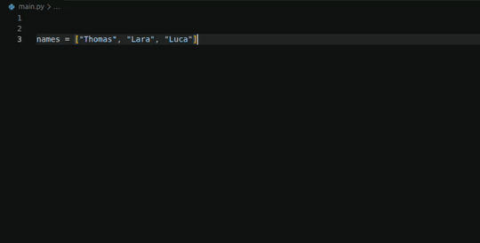

> [!TIP] Tipp:
>
> VS Code unterstützt uns beim Programmieren:
> * **`TAB`**: Vorschlag übernehmen und Code vervollständigen
> * **`↑` / `↓`**: Zwischen den Vorschlägen wechseln
> * **Mit der Maus über Code fahren**: Informationen zu Funktionen, Methoden, Variablen und deren Verwendung anzeigen
> * **Gelb unterkringelt**: Hinweis oder Warnung: der Code funktioniert oft trotzdem, sollte aber überprüft werden
> * **Rot unterkringelt**: Hier liegt wahrscheinlich ein Fehler im Code vor

## 8. Jupyter Notebooks

Die folgenden Module 2–7 sind keine `.py`-Dateien, sondern **Jupyter Notebooks** (`.ipynb`).  
Ein Notebook mischt **Text** und **ausführbare Code-Zellen** – so kannst du Erklärungen lesen und den Code direkt daneben ausprobieren.

### 8.1 Jupyter-Erweiterung installieren

Damit VS Code Notebooks öffnen und ausführen kann, brauchen wir nur **eine Erweiterung**:

1. Öffne die Erweiterungsseite z.B. mit `STRG` + `SHIFT` + `X`
2. Suche nach `Jupyter` und klicke auf **Installieren**

### 8.2 Projekt-Umgebung mit `uv` einrichten

Dieses Projekt ist mit [`uv`](https://docs.astral.sh/uv/) aufgesetzt. Alle benötigten Pakete (u. a. `ipykernel` für die Notebooks) sind bereits in der `pyproject.toml` hinterlegt.

Nach dem Klonen des Projekts genügt **ein Befehl** im Terminal:

```sh
uv sync
```

Dadurch wird automatisch eine virtuelle Umgebung (`.venv`) angelegt sowie alle Abhängigkeiten aus der `uv.lock` installiert.  
Falls `uv` nicht auf dem System installiert ist, führe folgenden Befehl aus:

```sh
curl -LsSf https://astral.sh/uv/install.sh | sh
```

### 8.3 Notebook öffnen und Kernel auswählen

Anschließend kannst du eine `.ipynb`-Datei per Doppelklick öffnen und einzelne Code-Zellen mit `SHIFT` + `ENTER` ausführen.

> [!NOTE] Info:
>
> Beim ersten Ausführen fragt VS Code nach einem **Kernel**. Wähle dort die Python-Umgebung aus dem Projekt-Ordner `.venv` aus.
> Da `ipykernel` durch `uv sync` bereits installiert ist, muss **nichts weiter installiert** werden.
