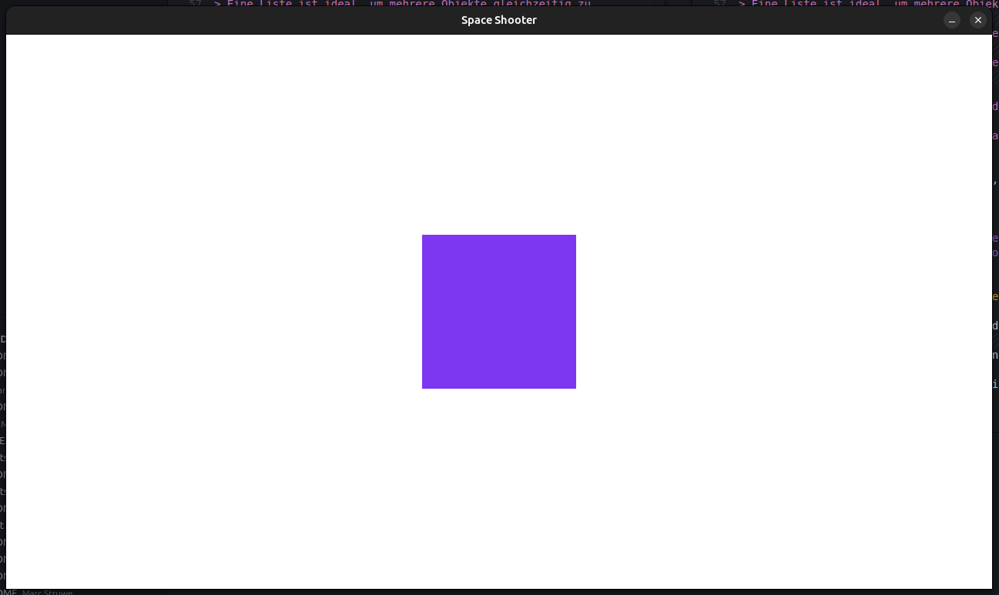

# Aufgabe 2 - Inhalt auf der Leinwand anzeigen

Jetzt, wo unser Spielfenster steht, wollen wir etwas zeichnen!  
In diesem Modul lernst du, wie man ein farbiges Rechteck auf der Zeichenfläche anzeigt und wie man es gezielt positionieren kann.

{width=50%}

## Schritt 1 - Eine neue Surface erzeugen

Als erstes erstellen wir eine neue Surface mit einer Größe von 200 × 200 Pixel.  
Füge den folgenden Code nach der Zeile `FRAMERATE = 60` ein:

```python
square = pygame.Surface((200, 200))
```

> [!note]INFO
>
> Wenn wir das Programm nun ausführen, sehen wir, dass die neue Surface `square` noch nicht sichtbar ist.  
> Der Grund ist, das `square` aktuell nur im Speicher existiert und noch nicht auf  
> die `display_surface` gezeichnet wurde!

## Schritt 2 - Neue Surface sichtbar machen

Jetzt wollen wir das **Quadrat** auf unserer **Display Surface** sichtbar machen.  
Füge dazu vor `pygame.display.flip()` (innerhalb der Game Loop) folgende Zeile ein:

```python
while running:
    # {...}
    # TODO: Hier werden wir unsere Spiellogik implementieren
    display_surface.blit(square, (0, 0))  # <---

    # Änderungen auf der Zeichenfläche sichtbar machen
    pygame.display.flip()
    # {...}
```

> [!note]INFO
>
> Die Methode `.blit()` fügt eine Surface auf eine andere ein, in unserem Fall `square` auf `display_surface`.  
> (0, 0) ist die Position auf der `display_surface`, an der das Quadrat erscheinen soll.  

## Schritt 3 - Wie funktionieren Positionen in pygame?

In pygame ist der **Ursprungspunkt (0, 0)** immer in der **oberen linken Ecke**.  
Dieses Verhalten gilt für alle Surfaces, nicht nur für die Display Surface!

```python
(0,0) ─────────────────────> x (rechts)
  │
  │          Surface
  ▼
  y (unten)
```

### Das bedeutet:
* **X-Wert:** 0 ist ganz links, positive Werte bewegen das Objekt nach rechts
* **Y-Wert:** 0 ist ganz oben, positive Werte bewegen das Objekt nach unten.

## Schritt 4 - Quadrat oben rechts positionieren

Da wir nun die Positionierung in pygame kennen, koennen wir das Quadrat z.B. **oben rechts in der Ecke** positionieren.

> [!note]Hinweis
>
> Gegeben sind die Breite der Display Surface, die Breite des Quadrats, sowie die Ursprungspunkte der Surfaces!

<details>
<summary>

#### Lösung

</summary>

Um den X-Wert zu berechnen, nehmen wir  die `WINDOW_WIDTH` (1280 Pixel), also die Breite unser Display Surface  
und ziehen die Breite des Quadrats (200 Pixel) ab, da der Ursprung des Quadrats bei (0, 0) verschoben wird.

```python
display_surface.blit(square, (WINDOW_WIDTH - 200, 0))
```

> [!note]INFO
>
> Man könnte jetzt meinen, dass man jedes Mal die Position anhand von Pixeln selbst berechnen muss, aber dafür  
> gibt es in pygame einen deutlich besseren Ansatz.

</details>

## Schritt 5 - Positionen setzen, aber einfach!

Jede Surface in pygame kann ueber `.get_rect()` ein sogenanntest **Rect-Objekt** erhalten.  
Das **Rect** ist ein Rechteck mit vielen hilfreichen Attributen.  
Es stellt z.B. Attribute wie
* `topleft`
* `topright`
* `center`
* `bottomleft`
* usw. zur Verfügung.

Füge den folgenden Code nach der Zeile `square = pygame.Surface((200, 200))` ein:

```python
square_rect = square.get_rect()
square_rect.topright = (WINDOW_WIDTH, 0)
```

Und ändere die Anzeige innerhalb der Game Loop entsprechend ab:

```diff
  # TODO: Hier werden wir unsere Spiellogik implementieren
- display_surface.blit(square, (WINDOW_WIDTH - 200, 0))
+ display_surface.blit(square, square_rect)
```

## Schritt 6 - Quadrat mittig positionieren

Da wir nun Rects kennengelernt haben, möchten wir unser Quadrat  
**genau mittig** auf der Display Surface platzieren.

<details>
<summary>

#### Lösung

</summary>

Um die X- sowie Y-Position berechnen zu können, benötigen wir hierfür die Breite und Höhe  
unserer Display Surface und teilen diese jeweils durch 2 um das Zentrum zu erhalten.  
Mit Hilfe des `center` Attributs zentrieren wir das Rect auf der Display Surface.

```diff
  square_rect = square.get_rect()
- square_rect.topright = (WINDOW_WIDTH, 0)
+ square_rect.center = (WINDOW_WIDTH / 2, WINDOW_HEIGHT / 2)
```

</details>

## Schritt 7 - Farbe des Quadrats ändern

So wie wir die Display Surface bei jedem Schleifendurchgang der Game Loop weiß färben,  
können wir das gleiche mit dem Quadrat machen.  
Färbe das Quadrat z.B. in der Farbe Lila ein.

> [!note]INFO
>
> pygame liefert bereits einige Farben mit Namen aus. Eine vollständige Liste findest du [hier](https://pyga.me/docs/ref/color_list.html).  
> **Alternativ** können RGB-Werte angegeben werden, z.B. im genua style: (125, 55, 240)  
> **RGB** steht für **R**ot, **G**rün und **B**lau)  
> Ein [Color Picker](https://g.co/kgs/tF3J2hR) kann einem beim Finden einer passenden Farbe helfen.

<details>
<summary>

#### Lösung

</summary>

Füge folgende Zeile z.B. nach `square = pygame.Surface((200, 200))` ein:

```python
square.fill((125, 55, 240))
```

</details>

## Kompletter Code

<details>
<summary>

#### Anzeigen

</summary>

```python
import pygame

# Grundlegendes Setup
pygame.init()

# Fenstergröße festlegen und Fenster erstellen
WINDOW_WIDTH, WINDOW_HEIGHT = 1280, 720
display_surface = pygame.display.set_mode((WINDOW_WIDTH, WINDOW_HEIGHT))

# Fenstertitel setzen
pygame.display.set_caption("Space Shooter")

# Framerate und Clock definieren
clock = pygame.time.Clock()
FRAMERATE = 60

# Quadrat definieren
square = pygame.Surface((200, 200))
square.fill((125, 55, 240))
square_rect = square.get_rect()
square_rect.center = (WINDOW_WIDTH / 2, WINDOW_HEIGHT / 2)

# Game Loop
running = True
while running:
    # Eingaben (Events) abfragen
    for event in pygame.event.get():
        if event.type == pygame.QUIT:
            running = False

    # Zeichenfläche zurücksetzen
    display_surface.fill("white")

    # TODO: Hier werden wir unsere Spiellogik implementieren

    # Quadrat auf Display Surface zeichnen
    display_surface.blit(square, square_rect)

    # Änderungen auf der Zeichenfläche sichtbar machen
    pygame.display.flip()

    # Framerate limitieren
    clock.tick(FRAMERATE)

# Anwendung sauber beenden
pygame.quit()
```

</details>
