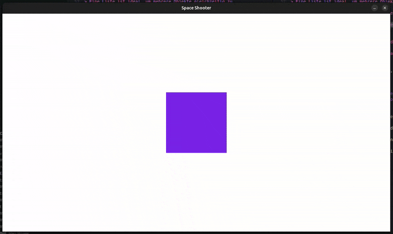

# Aufgabe 3 - Bewegungen mit Tastatureingabe (WASD)

In diesem Modul lernst du, wie du Tasteneingaben abfragen kannst, um Objekte auf dem Bildschirm zu bewegen  
und warum dabei die Bildwiederholungsrate (Framerate) eine wichtige Rolle spielt.

{width=50%}

## Schritt 1 - Tasteneingaben abfragen

In pygame können wir den aktuellen Zustand der Tastatur mit [`pygame.key.get_pressed()`](https://pyga.me/docs/ref/key.html#pygame.key.get_pressed) abfragen.  
Diese Methode liefert eine Liste, in der jeder Eintrag angibt, ob eine Taste gerade **gedrückt ist** (`True`) oder **nicht** (`False`).

Füge innerhalb der Game Loop folgendes ein:

```python
    # {...}
    # TODO: Hier werden wir unsere Spiellogik implementieren
    keys = pygame.key.get_pressed()

    if keys[pygame.K_w]:
        print("W wird gedrückt!")
    # {...}
```

> [!note]INFO
>
> Die Konstanten wie `pygame.K_w`, `K_a`, `K_s`, `K_d` stehen für die Tasten W, A, S, D, ideal für Bewegungssteuerung.  
> Weitere dieser Konstanten findest du in der [offiziellen Doku](https://pyga.me/docs/ref/key.html#:~:text=pygame%0AConstant%20%20%20%20%20%20ASCII%20%20%20Description).

## Schritt 2 - Quadrat bewegbar machen

Jetzt wollen wir unser Quadrat mit den Tasten **WASD** steuerbar machen.  
Ändere zum Beispiel den Code für die Taste `W` wie folgt ab:

```diff
  if keys[pygame.K_w]:
-     print("W wird gedrückt!")
+     square_rect.y -= 10 # in Pixel
```

Erweitere nun diesen Ansatz mit den Tasten **ASD**, damit das Quadrat in jede Richtung bewegt werden kann.

<details>
<summary>

#### Lösung

</summary>

```python
if keys[pygame.K_w]:
    square_rect.y -= 10 # nach oben
if keys[pygame.K_s]:
    square_rect.y += 10 # nach unten
if keys[pygame.K_a]:
    square_rect.x -= 10 # nach links
if keys[pygame.K_d]:
    square_rect.x += 10 # nach rechts
```

</details>

## Schritt 3 - Framerate beeinflusst die Bewegung?

Wir erinnern uns an [Aufgabe 1](../exercise-01/README.md), in der wir die Bildwiederholungsrate über die folgenden Zeilen beschränkt haben:

```python
FRAMERATE = 60
# {...}
clock.tick(FRAMERATE)
```

> [!note]INFO
>
> **Achtung:** Diese Zeilen bedeuten nur, dass die Game Loop maximal 60 Mal pro Sekunde durchlaufen werden soll, sie muss es aber nicht!

Was wäre, wenn wir einen schlechteren Computer hätten, welcher gerade mal 30 Bilder pro Sekunde schafft?  
Wir können das testen, in dem wir die Framerate manuell auf `30` FPS beschränken:

```diff
- FRAMERATE = 60
+ FRAMERATE = 30
```

Was wäre, wenn wir unser Spiel fertig entwickelt hätten, aber wir jetzt doch lieber mehr Bilder pro Sekunde zulassen möchten?  
Als nächstes setzen wir die Framerate mal auf `120` Bilder pro Sekunde:

```diff
- FRAMERATE = 30
+ FRAMERATE = 120
```

Was fällt dir auf?

<details>
<summary>

#### Lösung

</summary>

Wenn wir die Framerate ...

* halbieren (z.B. von `60` auf `30`), bewegt sich das Quadrat nur halb so schnell
* verdoppeln (z.B. von `60` auf `120`), bewegt es sich doppelt so schnell

#### Rechnerisch:

| FPS |  Berechnung | Bewegung pro Sekunde |
| --- | ----------- | -------------------- |
|  30 | 10 px ×  30 |        300 px        |
|  60 | 10 px ×  60 |        600 px        |
| 120 | 10 px × 120 |       1200 px        |

> [!note]INFO
>
> **Begründung:** Da wir aktuell bei jedem Schleifendurchlauf das Quadrat z.B. um 10 Pixel nach oben verschieben,  
> hängt die Bewegung direkt von der Framerate ab.  
> **Nachteil:** Die Bewegung ist damit nicht konstant, da je nach Rechner oder Spielphase das Spiel ganz anders reagieren kann.

</details>

## Schritt 4 - Bewegungen unabhängig von der Framerate

Um die Bewegung unabhängig von der Framerate zu gestalten, benötigt man die Zeit, die seit dem letzten Frame,  
bzw. letzen Schleifendurchlauf der Game Loop vergangen ist.  
Diese Zeitdifferenz nennt man `delta_time` (oder kurz: `dt`).  
Füge direkt nach `FRAMERATE = 60` folgende Zeile ein:

```python
delta_time = 0
```

Und passe am Ende der Game Loop diese Zeile an:

```diff
- clock.tick(FRAMERATE)
+ delta_time = clock.tick(FRAMERATE) / 1000 # ms -> Sekunden
```

Als nächstes müssen wir die `delta_time` noch bei der Bewegung des Quadrats implementieren:

```python
    if keys[pygame.K_w]:
        square_rect.y -= 10 * delta_time
    if keys[pygame.K_s]:
        square_rect.y += 10 * delta_time
    if keys[pygame.K_a]:
        square_rect.x -= 10 * delta_time
    if keys[pygame.K_d]:
        square_rect.x += 10 * delta_time
```

> [!note]INFO
>
> Durch diese Änderung wird jetzt nicht mehr pro Frame um einen festen Wert, sondern um einen Wert basierend auf der Zeit verschoben.  
> **Ergebnis:** Wir erhalten eine gleichmäßige Bewegung, unabhängig von der Framerate!


#### Rechnerisch sieht das so aus:

**Ungefähr gilt:** `delta_time ≈ 1 / FRAMERATE`

| FPS |      Berechnung     | Bewegung pro Sekunde |
| --- | ------------------- | -------------------- |
|  30 | 10 × (1/ 30) ×  30  |        ≈ 10 px       |
|  60 | 10 × (1/ 60) ×  60  |        ≈ 10 px       |
| 120 | 10 × (1/120) × 120  |        ≈ 10 px       |

## Schritt 5 - Problem: Bewegung nur in eine Richtung?

Testet man das Spiel jetzt mit `delta_time`, wird man folgendes festellen:

* Das Quadrat bewegt sich nach **oben/links** (negative Verschiebung)
* Aber nach **rechts/unten** passiert nichts (positive Verschiebung)

#### Woran liegt das?

<details>
<summary>

#### Lösung

</summary>

Der Rückgabewert von `get_rect()` ist ein **Rect**, welches nur **ganzzahlige Werte** (`int`) speichert.  
Bei hoher Framerate ist `delta_time` sehr klein (~0,017 bei 60 FPS).  
Ein Rect **rundet** diesen Wert beim Setzen der Position einfach **ab** – und bewegt sich somit gar nicht sichtbar.
Aus diesem Grund war die negative gegenüber zur positiven Bewegung sichtbar.

#### Beispiel:

* **Start-Position:** X = 50  
* **Positive Bewegung:** `50 px + 10 px × 0.017 ≈ 50.17` → `int: 50`  
* **Negative Bewegung:** `50 px - 10 px × 0.017 ≈ 49.83` → `int: 49`

> [!note]INFO
>
> **Lösung:** Statt `get_rect()` verwenden wir `get_frect()`, ein sogenanntes **FRect**, welches auch **Dezimalstellen** erlaubt  
> und die gespeicherte Position nicht abrundet.

Ändere daher:

```diff
- square_rect = square.get_rect()
+ square_rect = square.get_frect()
```

Jetzt wird die Position **intern mit Kommazahlen** gespeichert und nur beim Zeichnen auf ganze Pixel gerundet.

Da wir das Quadrat aber aktuell nur um `10 px` bewegen und zuvor ohne `delta_time` um `600 px` bewegt haben,  
sollten wir dies noch anpassen:

```diff
  if keys[pygame.K_w]:
-     square_rect.y -= 10 * delta_time
+     square_rect.y -= 600 * delta_time
  if keys[pygame.K_s]:
-     square_rect.y += 10 * delta_time
+     square_rect.y += 600 * delta_time
  if keys[pygame.K_a]:
-     square_rect.x -= 10 * delta_time
+     square_rect.x -= 600 * delta_time
  if keys[pygame.K_d]:
-     square_rect.x += 10 * delta_time
+     square_rect.x += 600 * delta_time
```

</details>

## Kompletter Code

<details>
<summary>

#### Anzeigen

</summary>

```python
import pygame

# Grundlegendes Setup
pygame.init()

# Fenstergröße festlegen und Fenster erstellen
WINDOW_WIDTH, WINDOW_HEIGHT = 1280, 720
display_surface = pygame.display.set_mode((WINDOW_WIDTH, WINDOW_HEIGHT))

# Fenstertitel setzen
pygame.display.set_caption("Space Shooter")

# Framerate und Clock definieren
clock = pygame.time.Clock()
FRAMERATE = 60
delta_time = 0

# Quadrat definieren
square = pygame.Surface((200, 200))
square.fill((125, 55, 240))
square_rect = square.get_frect()
square_rect.center = (WINDOW_WIDTH / 2, WINDOW_HEIGHT / 2)

# Game Loop
running = True
while running:
    # Eingaben (Events) abfragen
    for event in pygame.event.get():
        if event.type == pygame.QUIT:
            running = False

    # Zeichenfläche zurücksetzen
    display_surface.fill("white")

    # TODO: Hier werden wir unsere Spiellogik implementieren

    # Liste aller Tasten (gedrückt / nicht gedrückt)
    keys = pygame.key.get_pressed()

    # Tasten-Abfrage, um Quadrat zu bewegen
    if keys[pygame.K_w]:
        square_rect.y -= 600 * delta_time
    if keys[pygame.K_s]:
        square_rect.y += 600 * delta_time
    if keys[pygame.K_a]:
        square_rect.x -= 600 * delta_time
    if keys[pygame.K_d]:
        square_rect.x += 600 * delta_time

    # Quadrat auf Display Surface zeichnen
    display_surface.blit(square, square_rect)

    # Änderungen auf der Zeichenfläche sichtbar machen
    pygame.display.flip()

    # Delta Time berechnen (Sekunden seit letztem Frame)
    delta_time = clock.tick(FRAMERATE) / 1000  # ms -> Sekunden

# Anwendung sauber beenden
pygame.quit()
```

</details>
