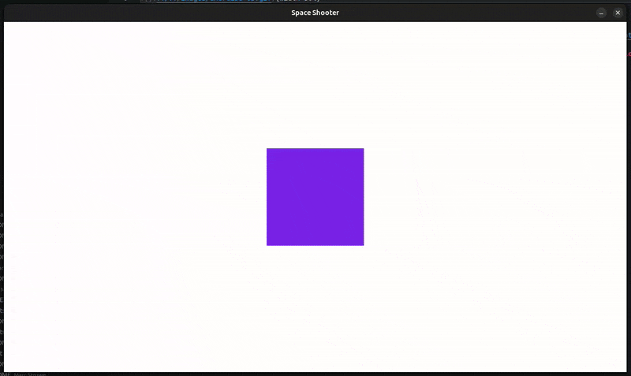

# Aufgabe 4 - Projektile feuern

In diesem Modul erweitern wir unser Spiel um Projektile, die vom Spieler abgefeuert werden können.  
Dabei orientieren wir uns an unserem Quadrat und lernen,  
wie man mit einem Tastendruck Objekte erstellt und sie über Zeit bewegt.

{width=50%}

## Schritt 1 - Projektil als Surface definieren

Wie bei unserem Quadrat, brauchen wir auch für Projektile zwei Dinge:

1. Eine **Surface**, welche das Aussehen definiert
2. Ein **FRect**, welches die Position auf dem Bildschirm beschreibt

Erstelle ein Projektil mit den Maßen `10 x 40` und positioniere es testweise auf dem Bildschirm.

<details>
<summary>

#### Lösung

</summary>

Füge unterhalb der Quadrat-Definition folgendes ein: 

```python
projectile = pygame.Surface((10, 40))
projectile_rect = projectile.get_frect()
```

Damit wir die neue Surface auch sehen können, müssen wir innerhalb der Game Loop, z.B. nach der Tastenabfrage folgendes einfügen:

```python
display_surface.blit(projectile, projectile_rect)
```

</details>

## Schritt 2 - Mehrere Projektile durch eine Liste verwalten

### Warum reicht ein `projectile_rect` nicht aus?

Wenn wir bei jedem Tastendruck ein neues Projektil erzeugen wollen, brauchen wir **für jedes** eine **eigene Position**.  
Ein einzelnes `FRect` (wie `projectile_rect`) speichert aber nur eine Position, dadurch würde jedes neue Projektil einfach das alte überschreiben.

**Lösung:** Wir erstellen eine **Liste**, in der wir alle `FRects` der aktiven Projektile speichern.
So können wir **jedes einzelne** Projektil verwalten und zeichnen.

Ersetze deshalb:

```diff
- projectile_rect = projectile.get_frect()
+ projectile_rects = []
```

> [!note]INFO
>
> Eine Liste ist ideal, um mehrere Objekte gleichzeitig zu verwalten.  
> Genau wie ein Spiel mehrere Gegner oder Partikel enthalten kann,  
> können wir hier mehrere Projektile gleichzeitig sichtbar machen.  
>  
> `projectile_rects` wird später bei jedem Schuss mit einem neuen `FRect` gefüllt,  
> also immer mit der Position, an der das neue Projektil erscheinen soll.

Kommentiere vorübergehend die Zeile aus, in der du das Projektil gezeichnet hast:

```diff
- display_surface.blit(projectile, projectile_rect)
+ # display_surface.blit(projectile, projectile_rect)
```

## Schritt 3 - Projektil per Leertaste erstellen

Nun fragen wir in der Game Loop ab, ob die Leertaste gedrückt wurde.  
Versuche das zuerst selbst. Hierbei kann man sich an unsere vorherigen Abfragen orientieren.  
Wenn `space` gedrückt wird, gebe z.B. einen Text `Abschuss!` aus.

<details>
<summary>

#### Lösung

</summary>

```diff
  if keys[pygame.K_d]:
      square_rect.x += movement_speed * delta_time

+ if keys[pygame.K_SPACE]:
+     print("Abschuss!")
```

</details>

Nun soll beim Drücken der Leertaste ein Projektil erstellt und zur Liste `projectile_rects` hinzugefügt werden.  
Achte darauf, dass es **oberhalb** des Quadrats erscheinen soll.

> [!note]INFO
>
> Um das Projektil direkt oberhalb des Quadrats zu platzieren, nutzen wir die Position `midtop` vom Quadrat.  
> Weitere Positionen: [Offizielle Doku](https://pyga.me/docs/ref/rect.html#:~:text=The%20Rect%20object%20has%20several%20virtual%20attributes%20which%20can%20be%20used%20to%20move%20and%20align%20the%20Rect%3A)

<details>
<summary>

#### Lösung

</summary>

Entweder:

```diff
  if keys[pygame.K_SPACE]:
-     print("Abschuss!")
+     temp = projectile.get_frect()
+     temp.midbottom = square_rect.midtop
+     projectile_rects.append(temp)
```

Oder kurz:

```diff
  if keys[pygame.K_SPACE]:
-     print("Abschuss!")
+     temp = projectile.get_frect(midbottom=(square_rect.midtop))
+     projectile_rects.append(temp)
```

</details>

## Schritt 4 - Alle Projektile anzeigen

Aktuell sehen wir unsere Projektile noch nicht, da wir nur **eins** gezeichnet hatten und es auch auskommentiert ist.  
Jetzt versuchen wir alle Projektile aus unserer Liste `projectile_rects` zu zeichnen.

> [!note]INFO
>
> Eine **for-Schleife** hilft uns, jedes `FRect` aus der `projectile_rects` zu zeichnen.  
> So können mehrere Projektile unabhängig voneinander angezeigt und später bewegt werden.  
> **Beispiel:** `for rect in rects:`

<details>
<summary>

#### Lösung

</summary>

```diff
- # display_surface.blit(projectile, projectile_rect)
+ for projectile_rect in projectile_rects:
+     display_surface.blit(projectile, projectile_rect)
```

Wenn man das Spiel nun startet und mehrfach die Leertaste drückt,  
sieht man, wie neue Projektile erscheinen, sie sich aber noch nicht bewegen!

</details>

## Schritt 5 - Projektile nach oben bewegen

Jetzt bringen wir unsere Projektile in Bewegung.  
Da der Ursprung  `(0, 0)` oben links ist, bewegen sich Objekte nach oben, wenn wir ihre `y`-Koordinate verringern.  
Versuche das innerhalb der Schleife zu ergänzen:

> [!note]INFO
>
> Genau wie beim Quadrat nutzen wir `delta_time`, um die Bewegungsgeschwindigkeit unabhängig von der Framerate zu machen.

<details>
<summary>

#### Lösung

</summary>

```diff
  for projectile_rect in projectile_rects:
+     projectile_rect.y -= 800 * delta_time
      display_surface.blit(projectile, projectile_rect)
```

</details>

## Schritt 6 - Cooldown für die Feuerrate

Wenn man die Leertaste aktuell gedrückt hält, werden extrem viele  
Projektile pro Sekunde erzeugt.  
Das sieht nicht nur nicht gut aus sondern bremst auf Dauer auch das Spiel aus.  
**Lösung:** Wir brauchen eine Art Cooldown, also eine Mindestzeit, die zwischen zwei Schüssen vergangen sein muss.

Füge folgende Zeile unterhalb der Projektil-Liste ein:

```python
last_shot = pygame.time.get_ticks()  # in ms
```

Dann bei unserer Tastenabfrage innerhalb der Game Loop:

```python
if keys[pygame.K_SPACE]:
    current_time = pygame.time.get_ticks() # in ms

    if last_time - pygame.time.get_ticks() >= 500:
        temp = projectile.get_frect()
        projectiles.append(temp)
```

> [!note]INFO
>
> `pygame.time.get_ticks()` liefert uns die Zeit, die seit `pygame.init()` in Millisekunden vergangen ist.  
> Mit `>= 500` sagen wir, dass mindestens `0.5` Sekunden bis zum nächsten Schuss gewartet werden muss, bis ein neues Projekt erstellt werden darf.

## Kompletter Code

<details>
<summary>

#### Anzeigen

</summary>

```python
import pygame

# Grundlegendes Setup
pygame.init()

# Fenstergröße festlegen und Fenster erstellen
WINDOW_WIDTH, WINDOW_HEIGHT = 1280, 720
display_surface = pygame.display.set_mode((WINDOW_WIDTH, WINDOW_HEIGHT))

# Fenstertitel setzen
pygame.display.set_caption("Space Shooter")

# Framerate und Clock definieren
clock = pygame.time.Clock()
FRAMERATE = 60
delta_time = 0

# Quadrat definieren
square = pygame.Surface((200, 200))
square.fill((125, 55, 240))
square_rect = square.get_frect()
square_rect.center = (WINDOW_WIDTH / 2, WINDOW_HEIGHT / 2)

# Projektil definieren
projectile = pygame.Surface((10, 40))
projectile_rects = []
last_shot = pygame.time.get_ticks()  # in ms

# Game Loop
running = True
while running:
    # Eingaben (Events) abfragen
    for event in pygame.event.get():
        if event.type == pygame.QUIT:
            running = False

    # Zeichenfläche zurücksetzen
    display_surface.fill("white")

    # TODO: Hier werden wir unsere Spiellogik implementieren

    # Liste aller Tasten (gedrückt / nicht gedrückt)
    keys = pygame.key.get_pressed()

    # Tasten-Abfrage, um Quadrat zu bewegen
    if keys[pygame.K_w]:
        square_rect.y -= 600 * delta_time
    if keys[pygame.K_s]:
        square_rect.y += 600 * delta_time
    if keys[pygame.K_a]:
        square_rect.x -= 600 * delta_time
    if keys[pygame.K_d]:
        square_rect.x += 600 * delta_time

    # Tasten-Abfrage, um Projektil zu erstellen
    if keys[pygame.K_SPACE]:
        current_time = pygame.time.get_ticks()  # in ms

        if current_time - last_shot >= 500:
            temp = projectile.get_frect(midbottom=(square_rect.midtop))
            projectile_rects.append(temp)
            last_shot = current_time

    # Projektil(e) auf Display Surface zeichnen
    for projectile_rect in projectile_rects:
        display_surface.blit(projectile, projectile_rect)
        projectile_rect.y -= 800 * delta_time

    # Quadrat auf Display Surface zeichnen
    display_surface.blit(square, square_rect)

    # Änderungen auf der Zeichenfläche sichtbar machen
    pygame.display.flip()

    # Delta Time berechnen (Sekunden seit letztem Frame)
    delta_time = clock.tick(FRAMERATE) / 1000  # ms -> Sekunden

# Anwendung sauber beenden
pygame.quit()
```

</details>
