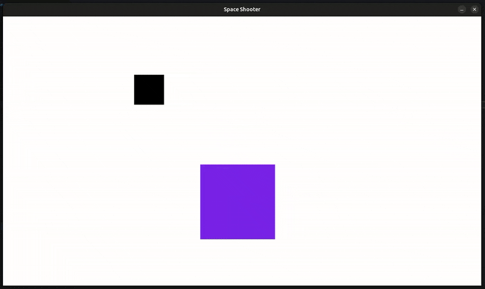

# Aufgabe 6 - Die Asteroiden-Logik

In diesem Modul erweitern wir unser Spiel um eine neue Klasse: **Asteroiden**.  
Diese sollen regelmäßig ins Bild fliegen und sich mit zufälliger Geschwindigkeit und Richtung bewegen.

{width=50%}


## Vorbereitung: Einstellungen global auslagern

Bevor wir mit der Asteroiden-Logik starten, lagern wir einige grundlegende Spielkonstanten aus, wie die Fenstergröße und Framerate.  
Das macht sie projektweit verfügbar und erspart uns, die Werte durch Funktionen oder Klassen zu reichen.

1. Innerhalb `settings.py`:

    ```python
    # Fenstergröße festlegen
    WINDOW_WIDTH, WINDOW_HEIGHT = 1280, 720
    # Framerate Limit
    FRAMERATE = 60
    ```

#### Anpassungen in `main.py`:

1. Import Statement:

    ```diff
    import pygame
    + import settings
    from entity.player import Player
    from entity.projectile import projectiles
    # {...}
    ```

2. Framerate entfernen und Spielerpositon anpassen:

    ```diff
    - # Framerate und Clock definieren
    + # Clock definieren
    clock = pygame.time.Clock()
    - FRAMERATE = 60
    delta_time = 0

    # Spieler initialisieren
    - player = Player((WINDOW_WIDTH / 2, WINDOW_HEIGHT / 2))
    + player = Player((settings.WINDOW_WIDTH / 2, settings.WINDOW_HEIGHT / 2))
    ```

3. Framerate in der Game Loop anpassen:

    ```diff
    # Delta Time berechnen (Sekunden seit letztem Frame)
    - delta_time = clock.tick(FRAMERATE) / 1000  # ms -> Sekunden
    + delta_time = clock.tick(settings.FRAMERATE) / 1000  # ms -> Sekunden
    ```

## Schritt 1 - Asteroid-Klasse erstellen

Erstelle in `entity/asteroid.py` eine neue Klasse `Asteroid`, welche auch von `pygame.sprite.Sprite` erbt.  
Der **Asteroid** soll eine **Größe von 80x80 Pixeln** haben und sich mit **300 Pixeln pro Sekunde** mittig, senkrecht **von oben nach unten bewegen**.  
Füge ihn außerdem zu der Sprite-Gruppe `asteroids` hinzu.

> [!note]INFO
>
> Implementiere die `update()`-Methode mit `delta_time`.

<details>
<summary>

#### Lösung

</summary>

`entity/asteroid.py`

```python
import pygame
import settings

asteroids = pygame.sprite.Group()

class Asteroid(pygame.sprite.Sprite):
    def __init__(self, *groups):
        super().__init__(*groups)

        self.image = pygame.Surface((80, 80))
        self.rect = self.image.get_frect(midbottom=(settings.WINDOW_WIDTH / 2, 0))
        self.add(asteroids)

        self.velocity = 300

    def update(self, delta_time):
        self.rect.center.y += self.velocity * delta_time
```

</details>

## Schritt 2 - Asteroiden spawnen

Füge in der `main.py` eine Logik ein, um **jede Sekunde** einen neuen Asteroiden zu erstellen.  
Nutze dafür `pygame.time.get_ticks()`, um einen Cooldown wirksam zu machen, ähnlich wie wir es bei den Projektilen gemacht haben.

> [!note]INFO
>
> Vergesse nicht `Asteroid` und `asteroids` in `main.py` zu importieren!  
> Neben der Spawn-Logik muessen wir die Gruppe `asteroids` auch updaten und zeichnen.

<details>
<summary>

#### Lösung

</summary>

1. Oberhalb der `main.py`:

    ```diff
    from entity.projectile import projectiles
    + from entity.asteroid import Asteroid, asteroids
    ```

2. Optional mit Hilfsvariablen:

    ```diff
    # Spieler initialisieren
    player = Player((settings.WINDOW_WIDTH / 2, settings.WINDOW_HEIGHT / 2))
    + # Asteroid Hilfsvariablen
    + last_asteroid_spawn = 0
    + asteroid_cooldown = 1000 # in ms
    ```

3. Innerhalb der Game Loop:

    ```diff
    # TODO: Hier werden wir unsere Spiellogik implementieren
    projectiles.update(delta_time)
    + asteroids.update(delta_time)
    player.update(delta_time)

    + # Asteroiden erzeugen
    + current_time = pygame.time.get_ticks()
    + if current_time - last_asteroid_spawn >= asteroid_cooldown:
    +     Asteroid()
    +     last_asteroid_spawn = current_time

    # Projektil(e) auf Display Surface zeichnen
    projectiles.draw(display_surface)

    + # Asteroid(en) auf Display Surface zeichen
    + asteroids.draw(display_surface)
    ```

> [!note]INFO
>
> Wenn wir das Spiel jetzt ausfuehren, sehen wir, dass die Asteroiden gleichmaessig spawnen,  
> jedoch immer mit gleicher Geschwindigkeit und Richtung.    
> Dieses Verhalten ist nicht gerade ideal fuer unser Spiel, aus diesem Grund benoetigen wir hier den "Zufall".

</details>

## Schritt 3 - Zufaellige Position & Geschwindigkeit

Aktuell sind alle Asteroiden identisch, was nicht gerade spannend ist.  
Was wir benoetigen, sind zufaellige Spawnpositionen sowie unterschiedliche Geschwindigkeiten.  
Python stellt einem hierfuer das Modul `random` zur Verfuegung.  
Aus `random` koennen wir mit Hilfe von `randint(a, b)` uns einen zufaelligen ganzzahligen Wert von a (untere Grenze) bis b (obere Grenze) zurueckgeben lassen.

#### Beispiel:

```python
from random import randint
x = randint(0, settings.WINDOW_WIDTH) # gibt z.B. 100 zurueck
```

#### Anwendung:

Da wir nun `randint()` kennen, koennen wir damit beim initialisieren der Klasse dem `FRect` eine zufaellige Position sowie `velocity` eine zuefaellige Geschwindigkeit geben.

> [!note]INFO
>
> 1. Denke beim `FRect` an das keyword `center`.
> 2. Definiere zuvor z.B. wie im Beispiel gezeigt ein x und y, welches einen Wert von `randint()` zurueckbekommt.

<details>
<summary>

#### Lösung

</summary>

Innerhalb der `Asteroid`-Klasse:

```diff
  import pygame
  import settings
+ from random import randint
+
  asteroids = pygame.sprite.Group()

  class Asteroid(pygame.sprite.Sprite):
      def __init__(self, *groups):
          super().__init__(*groups)
  
+         x = randint(0, settings.WINDOW_WIDTH)
+         y = randint(-200, -100)
  
          self.image = pygame.Surface((80, 80))
+         self.rect = self.image.get_frect(center=(x, y))
          self.add(asteroids)
  
+         self.velocity = randint(200, 400)

      def update(self, delta_time):
          self.rect.center.y += self.velocity * delta_time
```

> [!note]INFO
>
> Wenn man das Spiel nun ausfuehrt, sieht man, dass die Asteroiden an unterschiedlichen Positionen mit unterschiedlicher Geschwindigkeit ins Spielfeld fliegen.  
> Aber dennoch fuehlt es sich noch nicht richtig an, denn die Asteroiden fliegen alle senkrecht nach unten!

</details>

## Schritt 4 - Zufaellige Richtung

Wir haben bereits erreicht, dass unsere Asteroiden zufällig spawnen und sich mit unterschiedlichen Geschwindigkeiten bewegen.  
Allerdings fliegen sie nur senkrecht nach unten und das ist auf Dauer ziemlich eintönig.  
Wir bringen jetzt etwas Abwechslung in die Flugrichtung, sodass die Asteroiden leicht nach links oder rechts abdriften können.

#### Richtung als Vektor denken

Bisher war unsere Bewegung einfach:

```python
self.rect.center.y += self.velocity * delta_time
```

Das entspricht einem Bewegungsvektor von `(x = 0, y = 1)`.  
**Das bedeutet:** Keine Bewegung nach links oder rechts.  
Wir wollen jetzt einen Richtungsvektor, der auch eine x-Komponente hat, z. B. (0.5, 1) oder (-0.7, 1).  
Damit bewegen sich die Asteroiden schräg. Mal leicht nach rechts, mal nach links.

#### Richtung als Vektor umsetzen

Pygame bietet uns eine elegante Lösung:  
Mit `pygame.math.Vector2()` können wir Bewegungsrichtungen als Vektor speichern und später ganz einfach damit rechnen.  
Zusätzlich importieren wir `uniform` aus dem `random`-Modul, um zufällige `float`-Zahlen zu generieren.  
Setzen wir das ganze mal in der `Asteroid`-Klasse um:

```diff
  import pygame
  import settings
+ from random import randint, uniform

  asteroids = pygame.sprite.Group()


  class Asteroid(pygame.sprite.Sprite):
      def __init__(self, *groups):
          super().__init__(*groups)
  
          x = randint(0, settings.WINDOW_WIDTH)
          y = randint(-200, -100)
  
          self.image = pygame.Surface((80, 80))
          self.rect = self.image.get_frect(center=(x, y))
          self.add(asteroids)
  
          self.velocity = randint(200, 400)
          self.direction = pygame.math.Vector2(uniform(-1, 1), 1)

      def update(self, delta_time):
+         self.rect.center += self.direction * self.velocity * delta_time
```

> [!note]INFO
>
> `x` ist ein zufaelliger Wert zwischen -1 (Bewegung nach links) und 1 (Bewegung nach rechts).  
>  `y = 1` beschreibt eine konstante Bewegung nach unten.  
> Da `self.direction` ein Vektor ist, können wir ihn direkt mit `self.velocity` und `delta_time` multiplizieren. Dadurch bewegen sich die Asteroiden jetzt gleichzeitig in x- und y-Richtung.


#### Aber was ist mit der Geschwindigkeit?

Vielleicht hast du dich gefragt:
Was passiert, wenn unser Richtungsvektor nicht die Länge 1 hat?

Dann würde sich die Gesamtgeschwindigkeit ändern, je nachdem wie stark sich der Asteroid zur Seite bewegt!

```python
self.direction = Vector2(0.5, 1)
```

Dieser Vektor hat die Länge: `√(0.5² + 1²) = √(0.25 + 1) = √1.25 ≈ 1.118`  
Wenn wir diesen Vektor mit `velocity = 400` multiplizieren,
bewegen wir uns effektiv mit ca. 447 px/sec, also schneller als gewollt.

**Das ist nicht der Sinn eines Richtungsvektors!**  
Wir wollen, dass sich alle Asteroiden gleich schnell bewegen, unabhängig von ihrer Richtung.

#### Lösung: `normalize()` verwenden!

Mit `normalize()` von pygame normalisieren wir jetzt den Richtungsvektor.  
Ein normalisierter Vektor (auch Einheitsvektor genannt) hat **immer Länge 1**.

```diff
  class Asteroid(pygame.sprite.Sprite):
    
      self.velocity = randint(200, 400)
      self.direction = pygame.math.Vector2(uniform(-1, 1), 1)
+     self.direction = self.direction.normalize()
```

> [!note]INFO
>
> Jetzt ist es egal, welchen `x`-Wert unser Vektor  zuvor hatte. Die tatsaechliche Geschwindigkeit bleibt jetzt bei `self.velocity`.  
> Du kannst auch testweise `self.direction` vorher und nachher ueber `print()` ausgeben, um sicher zu gehen, dass der Vektor normalisiert wurde.

## Kompletter Code

<details>
<summary>

#### Anzeigen

</summary>

`main.py`

```python
import pygame
import settings
from entity.player import Player
from entity.projectile import projectiles
from entity.asteroid import Asteroid, asteroids

# Grundlegendes Setup
pygame.init()

# Fenster erstellen
display_surface = pygame.display.set_mode(
    (settings.WINDOW_WIDTH, settings.WINDOW_HEIGHT)
)

# Fenstertitel setzen
pygame.display.set_caption("Space Shooter")

# Clock definieren
clock = pygame.time.Clock()
delta_time = 0

# Spieler initialisieren
player = Player((settings.WINDOW_WIDTH / 2, settings.WINDOW_HEIGHT / 2))

# Asteroid Hilfsvariablen
last_asteroid_spawn = 0
asteroid_cooldown = 1000  # in ms

# Game Loop
running = True
while running:
    # Eingaben (Events) abfragen
    for event in pygame.event.get():
        if event.type == pygame.QUIT:
            running = False

    # Zeichenfläche zurücksetzen
    display_surface.fill("white")

    # TODO: Hier werden wir unsere Spiellogik implementieren
    projectiles.update(delta_time)
    asteroids.update(delta_time)
    player.update(delta_time)

    # Asteroiden erzeugen
    current_time = pygame.time.get_ticks()
    if current_time - last_asteroid_spawn >= asteroid_cooldown:
        Asteroid()
        last_asteroid_spawn = current_time

    # Projektil(e) auf Display Surface zeichnen
    projectiles.draw(display_surface)

    # Asteroid(en) auf Display Surface zeichen
    asteroids.draw(display_surface)

    # Spieler auf Display Surface zeichnen
    display_surface.blit(player.image, player.rect)

    # Änderungen auf der Zeichenfläche sichtbar machen
    pygame.display.flip()

    # Delta Time berechnen (Sekunden seit letztem Frame)
    delta_time = clock.tick(settings.FRAMERATE) / 1000  # ms -> Sekunden

# Anwendung sauber beenden
pygame.quit()
```

`settings.py`

```python
# Fenstergröße festlegen
WINDOW_WIDTH, WINDOW_HEIGHT = 1280, 720
# Framerate Limit
FRAMERATE = 60
```


`entity/asteroid.py`

```python
import pygame
import settings
from random import randint, uniform

asteroids = pygame.sprite.Group()


class Asteroid(pygame.sprite.Sprite):
    def __init__(self, *groups):
        super().__init__(*groups)

        # Zufällige Position
        x = randint(0, settings.WINDOW_WIDTH)
        y = randint(-300, -80)

        self.image = pygame.Surface((80, 80))
        self.rect = self.image.get_frect(center=(x, y))

        # Zufällige Geschwindigkeit
        self.velocity = randint(200, 400)

        # Zufällige Richtung
        self.direction = pygame.math.Vector2(uniform(-1, 1), 1)
        self.direction = self.direction.normalize()

        self.add(asteroids)

    def update(self, delta_time):
        self.rect.center += self.direction * self.velocity * delta_time
```

`entity/player.py`

```python
import pygame
from entity.projectile import Projectile


class Player(pygame.sprite.Sprite):
    def __init__(self, position, *groups):
        super().__init__(*groups)

        self.image = pygame.Surface((200, 200))
        self.image.fill((125, 55, 240))
        self.rect = self.image.get_frect(center=position)

        self.last_shot = 0

    def update(self, delta_time):
        # Liste aller Tasten (gedrückt / nicht gedrückt)
        keys = pygame.key.get_pressed()

        # Tasten-Abfrage, um Spieler zu bewegen
        if keys[pygame.K_w]:
            self.rect.y -= 600 * delta_time
        if keys[pygame.K_s]:
            self.rect.y += 600 * delta_time
        if keys[pygame.K_a]:
            self.rect.x -= 600 * delta_time
        if keys[pygame.K_d]:
            self.rect.x += 600 * delta_time

        # Tasten-Abfrage, um Projektil zu erstellen
        if keys[pygame.K_SPACE]:
            current_time = pygame.time.get_ticks()  # in ms

            if current_time - self.last_shot >= 500:
                Projectile(self.rect.midtop)
                self.last_shot = current_time
```

`entity/projectile.py`

```python
import pygame

projectiles = pygame.sprite.Group()


class Projectile(pygame.sprite.Sprite):
    def __init__(self, spawn_position, *groups):
        super().__init__(*groups)

        self.image = pygame.Surface((10, 40))
        self.rect = self.image.get_frect(midbottom=spawn_position)

        self.add(projectiles)

    def update(self, delta_time):
        self.rect.y -= 800 * delta_time
```

</details>
