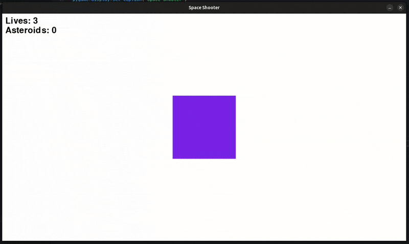
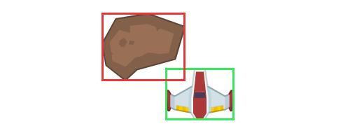
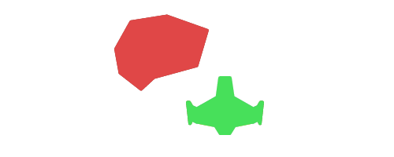

# Aufgabe 7 - Kollisionen

In diesem Modul bringen wir Logik in unser Spiel:
Wir kümmern uns um Kollisionen zwischen Spieler, Projektilen und Asteroiden – und sorgen dafür, dass sich keine Objekte endlos im Weltall verirren.
Außerdem führen wir ein neues Feature ein: Leben für den Spieler!

{width=50%}

## Schritt 1 - Wie prüft man Kollisionen?

#### 1. Rechteck-Kollision (`Rect`)

Die Rect-Kollision nutzt `.rect`-Attribute von Sprites, um einfache Überschneidungen zu erkennen.  
Das ist sehr performant und somit ideal für einfache Formen!

{width=50%}

#### 2. Pixelgenaue Kollision (`Mask`)

Mit `pygame.mask` kann man eine Art Schablone aus der Oberfläche erzeugen, um wirklich Pixel-Perfect zu erkennen, ob zwei Sprites sich überschneiden.  
Dieses Verfahren ist sehr genau, aber dafuer deutlich rechenintensiver!

{width=50%}

#### 3. Polygon/Mesh-Kollision (3D Engines)

In komplexeren Game Engines (z.B. Unreal Engine) werden oft sogenannte Mesh-Kollisionen verwendet. Sie sind ideal für unregelmäßige Formen in 3D-Spielen.

{width=50%}

> [!note]INFO
>
> Für unseren Space Shooter reichen uns aktuell `rect`-basierte Kollision völlig aus!

## Schritt 2 - Projektile treffen Asteroiden

Wir möchten erreichen, dass Projektile Asteroiden zerstören können.  
Beide liegen bereits in eigenen Sprite-Gruppen: `projectiles` und `asteroids`.

Normalerweise müssten wir hier z.B. über die Listen `projectiles` und `asteroids` iterieren, um herauszufinden, welche rects kollidieren.

Beispiel mit [colliderect()]:

```python
for projectile in projectils:
    for asteroid in asteroid:
        if projectile.rect.colliderect(asteroid.rect):
            projectile.kill()
            asteroid.kill()
```

Eine weitere Möglichkeit wäre [collidelist()](https://pyga.me/docs/ref/rect.html#pygame.Rect.collidelist):
Hier wird direkt der erste Treffer, als index zurückgegeben.

```python
for projectile in projectiles:
    asteroid_rects = [asteroid.rect for asteroid in asteroids]
    collision_index = projectile.rect.collidelist(asteroid_rects)
    if collision:
        projectile.kill()
        asteroids[collision_index]


```

Aber da wir schon Sprites verwenden, diese in Sprite-Gruppen speichern, sind die oben gezeigten Varianten nicht gerade ideal, denn für Sprite-Gruppen gibt es deutlich bessere Ansätze, die uns genau diese Arbeit abnehmen!

Nutze hierfür die eingebaute Methode [pygame.sprite.groupcollide()](https://pyga.me/docs/ref/sprite.html#pygame.sprite.groupcollide)
Sie prüft, ob sich Sprites aus zwei Gruppen überschneiden und gibt 

```python
pygame.sprite.groupcollide(
    projectiles,     # Gruppe A
    asteroids,       # Gruppe B
    True,            # Projektil entfernen -> projectile.kill()
    True             # Asteroid entfernen  -> asteroid.kill()
```

Wir fügen folgendes innerhalb der Game Loop von `main.py` ein:

```diff
  # {...}
  # TODO: Hier werden wir unsere Spiellogik implementieren

+  # Kollision: Projektile <-> Asteroiden
+  pygame.sprite.groupcollide(projectiles, asteroids, True, True)

  # Sprites updaten
  projectiles.update(delta_time)
  asteroids.update(delta_time)
  player.update(delta_time)
```

> [!note]INFO
>
> Das ist jetzt schon mal cool, aber wir was bringt es dem Spieler jetzt, wenn wir gar nicht zaehlen, wie viele Asteroiden er zerstoert hat?


#### Score pro zerstoerten Asteroid hinzufuegen

Das ist im Endeffekt sehr einfach. Wir muessen zuvor unserem `player`, also in der `Player`-Klasse ein weiteres Attribut definieren und diesen erhoehen, wenn ein Projektil einen Asteroiden trifft.

<details>
<summary>

#### Lösung

</summary>

`player.py`

```diff
  class Player(pygame.sprite.Sprite):
      def __init__(self, position, *groups):
          # {...}
          self.last_shot = 0
+         self.asteroids_destroyed = 0
```

Damit können wir jetzt über `player.asteroids_destroyed += 1` den Wert innerhalb `main.py`, der Game Loop bei unserer Kollisionsabfrage erhöhen.

```diff
   # Kollision: Projektile <-> Asteroiden
-  pygame.sprite.groupcollide(projectiles, asteroids, True, True)
+ projectile_asteroid_collisions = pygame.sprite.groupcollide(
+     projectiles, asteroids, True, True
+ )
+ if projectile_asteroid_collisions:
+     player.asteroids_destroyed += 1
```

> [!note]INFO
>
> Du kannst dir zum Testen auch den Score nach dem erhöhen ausgeben lassen, z.B. mit `print(f"Score: {player.asteroids_destroyed}")`

</details>

## Schritt 3 - Spieler trifft auf Asteroid

Auch der Spieler sollte mit Asteroiden kollidieren können und dabei Leben verlieren.
Angenommen, wir setzen innerhalb der Klasse `player` ein Attribut `lives = 3`, dann müssen wir innerhalb der `main.py`, der Game Loop prüfen, ob der `player` mit der Gruppe `asteroids` kollidiert.  
Hierfür verwenden wir [pygame.sprite.spritecollide()](https://pyga.me/docs/ref/sprite.html#pygame.sprite.spritecollide).

<details>
<summary>

#### Lösung

</summary>

`main.py`:

```python
# Kollision: Spieler <-> Asteroiden
if pygame.sprite.spritecollide(player, asteroids, dokill=True):
    player.lives -= 1
```

> [!note]INFO
>
> `dokill` bezieht sich hier auf Objekte aus der Gruppe, nicht auf das Sprite `player`!

Aber nur das reicht nicht, denn wenn wir der Spieler keine Leben mehr hat, sollten wir `running = False` setzen, damit das Spiel beendet wird, oder ein Death-Screen angezeigt wird.

```diff
  # Kollision: Spieler <-> Asteroiden
  if pygame.sprite.spritecollide(player, asteroids, dokill=True):
      player.lives -= 1
+     if player.lives == 0:
+         running = False
```

</details>

## Schritt 4 - Objekte ausserhalb des Bildschirms entfernen

Aktuell fliegen Projektile und Asteroiden unendlich weiter, selbst wenn sie nicht mehr sichtbar sind.  
Das verbraucht auf Dauer ordentlich Speicher und Kostet Leistung, da die Gruppe immer groesser wird und mehr moegliche Kollissionen abgefragt werden muessen.  
Das muss auf jeden Fall vermieden werden, wenn man das Spiel performant gestalten moechte!

Die Anpassung ist relativ simpel. In den Klassen `Projectile` sowie `Asteroid` muessen wir hierfuer Checks einbauen:

<details>
<summary>

#### Lösung

</summary>

1. Innerhalb `entity/projectile.py`:

  ```diff
    def update(self, delta_time):
        self.rect.y -= 800 * delta_time

  +     # Projektil außerhalb des Bildschirms entfernen
  +     if self.rect.bottom < 0:
  +         self.kill()
  ```

2. Innerhalb `entity/asteroid.py`:

```diff
  def update(self, delta_time):
      self.rect.center += self.direction * self.velocity * delta_time

+     # Asteroid außerhalb des Bildschirms entfernen
+     if (
+         self.rect.top > settings.WINDOW_HEIGHT
+         or self.rect.right < 0
+         or self.rect.left > settings.WINDOW_WIDTH
+     ):
+         self.kill()
```

## Schritt 5 - Bildschirmbegrenzung für den Spieler

Unser Spieler kann derzeit aus dem sichtbaren Bereich der Display Surface abhauen.  
Wir moechten stattdessen, dass er auf der gegenüberliegenden Seite wieder auftaucht!

Probiere es gerne mal aus:


1. `settings` importieren


2. Bilgschirmbegrenzung hinzufuegen:

```diff
  update(self, delta_time):
  # {...}
+ # Bildschirmbegrenzung
+ if self.rect.left > settings.WINDOW_WIDTH:
+     self.rect.right = 0
+ elif self.rect.right < 0:
+     self.rect.left = settings.WINDOW_WIDTH

+ if self.rect.top > settings.WINDOW_HEIGHT:
+     self.rect.bottom = 0
+ elif self.rect.bottom < 0:
+     self.rect.top = settings.WINDOW_HEIGHT
```

</details>

## Kompletter Code

<details>
<summary>

#### Anzeigen

</summary>

<details>
<summary>

#### `main.py`

</summary>

```python
import pygame
import settings
from entity.player import Player
from entity.projectile import projectiles
from entity.asteroid import Asteroid, asteroids
from debug import debug

# Grundlegendes Setup
pygame.init()

# Fenster erstellen
display_surface = pygame.display.set_mode(
    (settings.WINDOW_WIDTH, settings.WINDOW_HEIGHT)
)

# Fenstertitel setzen
pygame.display.set_caption("Space Shooter")

# Clock definieren
clock = pygame.time.Clock()
delta_time = 0

# Spieler initialisieren
player = Player((settings.WINDOW_WIDTH / 2, settings.WINDOW_HEIGHT / 2))

# Asteroid Hilfsvariablen
last_asteroid_spawn = 0
asteroid_cooldown = 1000  # in ms

# Game Loop
running = True
while running:
    # Eingaben (Events) abfragen
    for event in pygame.event.get():
        if event.type == pygame.QUIT:
            running = False

    # Zeichenfläche zurücksetzen
    display_surface.fill("white")
    debug(f"Lives: {player.lives}")
    debug(f"Asteroids: {player.asteroids_destroyed}", y=40)

    # TODO: Hier werden wir unsere Spiellogik implementieren

    # Kollision: Projektile <-> Asteroiden
    projectile_asteroid_collisions = pygame.sprite.groupcollide(
        projectiles, asteroids, True, True
    )
    if projectile_asteroid_collisions:
        player.asteroids_destroyed += 1

    # Kollision: Spieler <-> Asteroiden
    if pygame.sprite.spritecollide(player, asteroids, dokill=True):
        player.lives -= 1
        if player.lives == 0:
            running = False

    # Sprites updaten
    projectiles.update(delta_time)
    asteroids.update(delta_time)
    player.update(delta_time)

    # Asteroiden erzeugen
    current_time = pygame.time.get_ticks()
    if current_time - last_asteroid_spawn >= asteroid_cooldown:
        Asteroid()
        last_asteroid_spawn = current_time

    # Projektil(e) auf Display Surface zeichnen
    projectiles.draw(display_surface)

    # Asteroid(en) auf Display Surface zeichen
    asteroids.draw(display_surface)

    # Spieler auf Display Surface zeichnen
    display_surface.blit(player.image, player.rect)

    # Änderungen auf der Zeichenfläche sichtbar machen
    pygame.display.flip()

    # Delta Time berechnen (Sekunden seit letztem Frame)
    delta_time = clock.tick(settings.FRAMERATE) / 1000  # ms -> Sekunden

# Anwendung sauber beenden
pygame.quit()
```

</details>

<details>
<summary>

#### `entity/player.py`

</summary>

```python
import pygame
import settings
from entity.projectile import Projectile


class Player(pygame.sprite.Sprite):
    def __init__(self, position, *groups):
        super().__init__(*groups)

        self.image = pygame.Surface((200, 200))
        self.image.fill((125, 55, 240))
        self.rect = self.image.get_frect(center=position)

        self.last_shot = 0
        self.asteroids_destroyed = 0
        self.lives = 3

    def update(self, delta_time):
        # Liste aller Tasten (gedrückt / nicht gedrückt)
        keys = pygame.key.get_pressed()

        # Tasten-Abfrage, um Spieler zu bewegen
        if keys[pygame.K_w]:
            self.rect.y -= 600 * delta_time
        if keys[pygame.K_s]:
            self.rect.y += 600 * delta_time
        if keys[pygame.K_a]:
            self.rect.x -= 600 * delta_time
        if keys[pygame.K_d]:
            self.rect.x += 600 * delta_time

        # Tasten-Abfrage, um Projektil zu erstellen
        if keys[pygame.K_SPACE]:
            current_time = pygame.time.get_ticks()  # in ms

            if current_time - self.last_shot >= 500:
                Projectile(self.rect.midtop)
                self.last_shot = current_time

        # Bildschirmbegrenzung
        if self.rect.left > settings.WINDOW_WIDTH:
            self.rect.right = 0
        elif self.rect.right < 0:
            self.rect.left = settings.WINDOW_WIDTH

        if self.rect.top > settings.WINDOW_HEIGHT:
            self.rect.bottom = 0
        elif self.rect.bottom < 0:
            self.rect.top = settings.WINDOW_HEIGHT
```

</details>

<details>
<summary>

#### `entity/projectile.py`

</summary>

```python
import pygame

projectiles = pygame.sprite.Group()


class Projectile(pygame.sprite.Sprite):
    def __init__(self, spawn_position, *groups):
        super().__init__(*groups)

        self.image = pygame.Surface((10, 40))
        self.rect = self.image.get_frect(midbottom=spawn_position)

        self.add(projectiles)

    def update(self, delta_time):
        self.rect.y -= 800 * delta_time

        # Projektil außerhalb des Bildschirms entfernen
        if self.rect.bottom < 0:
            self.kill()
```

</details>

<details>
<summary>

#### `entity/asteroid.py`

</summary>

```python
import pygame
import settings
from random import randint, uniform

asteroids = pygame.sprite.Group()


class Asteroid(pygame.sprite.Sprite):
    def __init__(self, *groups):
        super().__init__(*groups)

        # Zufällige Position
        x = randint(0, settings.WINDOW_WIDTH)
        y = randint(-300, -80)

        self.image = pygame.Surface((80, 80))
        self.rect = self.image.get_frect(center=(x, y))

        # Zufällige Geschwindigkeit
        self.velocity = randint(200, 400)

        # Zufällige Richtung
        self.direction = pygame.math.Vector2(uniform(-1, 1), 1)
        self.direction = self.direction.normalize()

        self.add(asteroids)

    def update(self, delta_time):
        self.rect.center += self.direction * self.velocity * delta_time

        # Asteroid außerhalb des Bildschirms entfernen
        if (
            self.rect.top > settings.WINDOW_HEIGHT
            or self.rect.right < 0
            or self.rect.left > settings.WINDOW_WIDTH
        ):
            self.kill()
```

</details>
</details>